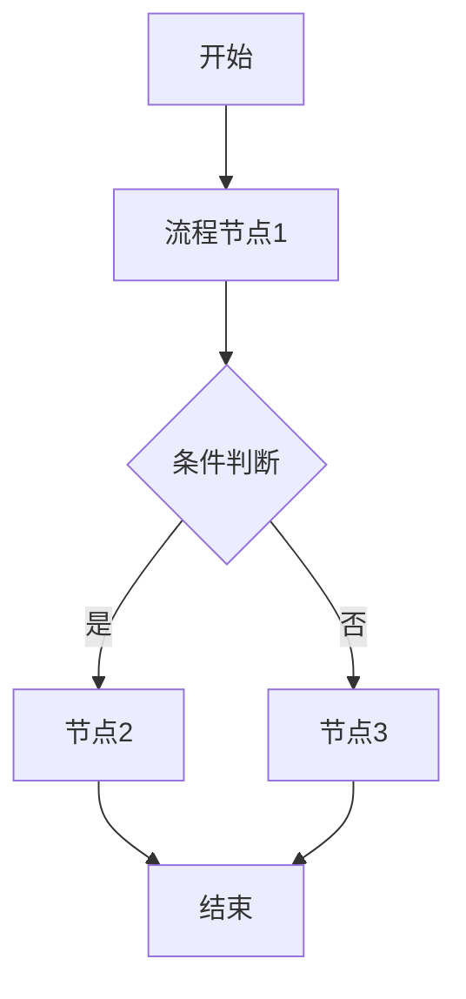
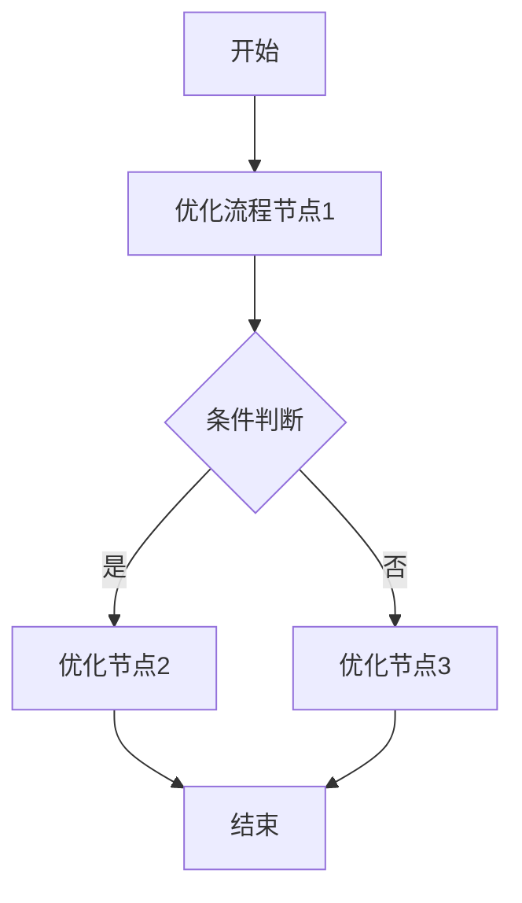

# 需求分析文档：{需求名称}

## 文档信息

| 字段 | 内容 |
|------|------|
| 需求名称 | {需求名称} |
| 文档版本 | V1.0 |
| 创建日期 | {YYYY-MM-DD} |
| 撰写人 | {撰写人} |
| 文档状态 | 草稿 / 评审中 / 已确认 |

---

## 一、需求背景与目标

### 1.1 需求背景

描述需求的业务场景和来源。

### 1.2 当前痛点

当前业务存在的主要问题或局限性。

### 1.3 核心目标

一句话描述本次需求的核心目标。

### 1.4 目标用户与使用场景

| 角色 | 使用场景 | 期望成果 |
|------|----------|----------|
| 角色1 | 场景描述 | 期望成果 |
| 角色2 | 场景描述 | 期望成果 |

### 1.5 当前功能现状

描述现有系统功能情况，以及与新需求的差距。

---

## 二、业务流程分析

### 2.1 当前流程（现状）

### 2.2 目标流程（改善后）

---

## 三、功能需求清单

### 3.1 角色A功能（示例）

**菜单位置**：`菜单位置`（新增/扩展）

| 功能 | 功能描述 | 优先级 |
|------|----------|--------|
| 功能1 | 场景化描述：谁+在什么场景+做什么+得到什么 | Must |
| 功能2 | 场景化描述 | Should |

### 3.2 角色B功能

**菜单位置**：`新增"XX管理"菜单`

| 功能 | 功能描述 | 优先级 |
|------|----------|--------|
| XX列表 | 展示XX信息，支持筛选查询；支持添加/编辑/启用/禁用等操作 | Must |

---

## 四、待确认事项

| 序号 | 待确认事项 | 优先级 | 状态 | 结论/说明 |
|------|------------|--------|------|-----------|
| 1 | 具体规则内容 | P0 | 待确认 | - |
| 2 | 已有结论的事项 | P1 | ✅ 已确认 | 结论说明 |

**确认原则**：
- P0 级别事项必须在 PRD 撰写前完成确认
- 未确认事项不得在 PRD 中编造，必须标注"待确认"