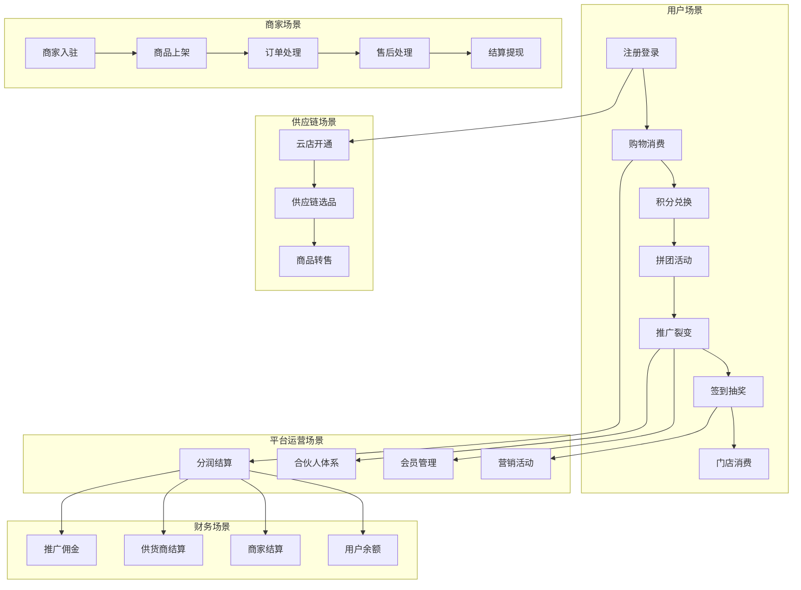
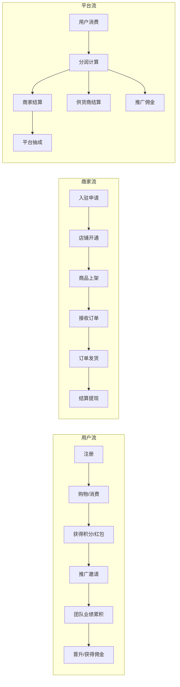

# 星马特平台业务场景全景

## 一、用户侧业务场景

### 1.1 会员注册与成长
```
用户注册 → 完善资料 → 购买推广商品 → 成为推广专员 → 晋升推广经理 → 晋升合伙人
```

### 1.2 商城购物
```
浏览商品 → 加入购物车 → 结算 → 选择地址 → 使用优惠券/积分抵扣 → 支付 → 商家发货 → 收货 → 评价
```

### 1.3 积分兑换
```
消费获积分 → 进入积分商城 → 浏览积分商品 → 使用积分兑换/抵扣 → 支付差价（如有） → 获得商品
```

### 1.4 拼团活动
```
浏览拼团商品 → 参与已有拼团 OR 发起新拼团 → 支付拼团价 → 邀请好友参团 → 拼团成功等待发货 OR 拼团失败退款
```

### 1.5 推广裂变
```
生成邀请码/海报 → 分享给好友 → 好友注册绑定推广关系 → 好友消费 → 推广者获得佣金与积分 → 团队业绩累积
```

### 1.6 签到与抽奖
```
每日签到获得积分 → 连续签到激励 → 签到抽奖 → 消耗积分/红包参与抽奖活动 → 中奖获得奖励
```

### 1.7 线下门店消费（O2O）
```
进入商圈 → 浏览附近门店 → 查看优惠活动 → 到店消费 → 扫码支付/出示优惠码 → 门店核销 → 获得积分/红包
```

---

## 二、商家侧业务场景

### 2.1 线上商家入驻
```
提交入驻申请 → 平台审核 → 签署协议 → 创建店铺 → 设置类目 → 上架商品 → 设置价格与促销 → 开始营业
```

### 2.2 线下门店入驻
```
提交门店资料 → 平台审核 → 入驻商圈 → 设置行业与优惠 → 上架商品/服务 → 开启核销功能
```

### 2.3 商家商品管理
```
添加商品 → 设置规格属性 → 设置价格与库存 → 设置运费模板 → 提交审核 → 上架销售
```

### 2.4 商家订单处理
```
接收订单 → 确认订单 → 打单发货 → 填写物流信息 → 等待买家收货 → 订单完成
```

### 2.5 商家售后服务
```
买家申请退款 → 商家审核 → 同意/拒绝 → 退款处理
买家申请退货 → 商家审核 → 买家退货 → 商家收货 → 确认收货 → 退款
买家申请换修 → 商家审核 → 买家寄回 → 商家处理 → 换货发出/维修
```

### 2.6 商家结算提现
```
查看结算记录 → 申请提现 → 平台打款 → 到账
```

---

## 三、供应链业务场景

### 3.1 云店开通
```
用户购买推广专员商品 → 成为专员 → 申请开通云店 → 供应链选品 → 商品上架云店 → 开始经营
```

### 3.2 供应链采购
```
浏览供应链商品 → 查看毛利率与指导价 → 选择商品加入云店 → 用户下单 → 供应链发货 → 云店转售
```

---

## 四、平台运营业务场景

### 4.1 分润结算
```
用户消费 → 积分计算 → 红包/奖励计算 → 推广佣金计算 → 商家结算 → 供货商结算 → 推广者佣金发放
```

### 4.2 会员等级管理
```
会员消费与推广 → 业绩累积 → 达到晋升门槛 → 晋升更高级别 → 享受更高权益与分润比例
```

### 4.3 营销活动运营
```
平台创建活动（签到/拼团/红包/抽奖） → 用户参与 → 奖励发放 → 活动数据统计
```

### 4.4 合伙人/专员体系
```
用户注册 → 购买升级商品 → 成为专员 → 推广用户 → 团队业绩累积 → 晋升推广经理 → 晋升合伙人
```

---

## 五、财务结算业务场景

### 5.1 用户侧
```
消费获得积分/红包 → 积分兑换/抵扣 → 红包抵现 → 余额提现
```

### 5.2 商家侧
```
销售收款（D+1结算） → 扣除平台分润 → 商家余额 → 申请提现 → 到账
```

### 5.3 供货商侧
```
云店销售供货 → 供货商结算 → 结算款项 → 申请提现 → 到账
```

### 5.4 推广者侧
```
团队成员消费 → 计算推广佣金 → 佣金发放至余额 → 申请提现 → 到账
```

---

## 六、业务场景总览图



---

## 七、场景与功能模块映射

| 业务场景 | 涉及端 | 核心功能模块 |
|---------|-------|-------------|
| 会员注册与成长 | 用户端/平台端 | 会员管理、合伙人管理、专员管理 |
| 商城购物 | 用户端/商家端/平台端 | 商品管理、订单管理、购物车、支付 |
| 积分兑换 | 用户端/平台端 | 积分商品、积分中心、订单管理 |
| 拼团活动 | 用户端/平台端 | 拼团管理、订单管理、营销中心 |
| 推广裂变 | 用户端/平台端 | 推广关系、佣金计算、会员推广 |
| 签到抽奖 | 用户端/平台端 | 签到管理、抽奖活动、积分管理 |
| 线下门店消费 | 用户端/商家端 | 商圈、门店核销、订单管理 |
| 商家入驻 | 商家端/平台端 | 商家管理、店铺管理、审核流程 |
| 商品管理 | 商家端/平台端 | 商品管理、分类管理、评价管理 |
| 订单处理 | 商家端/平台端 | 订单列表、售后管理、物流跟踪 |
| 云店经营 | 用户端/平台端 | 云店管理、云店选品、供应链 |
| 分润结算 | 平台端 | 结算中心、分润规则、财务管理 |
| 营销活动 | 用户端/平台端 | 拼团、红包、优惠券、抽奖 |
| 财务结算 | 商家端/供货商/推广者 | 提现管理、结算记录、余额管理 |

---

## 八、核心业务流程总图


