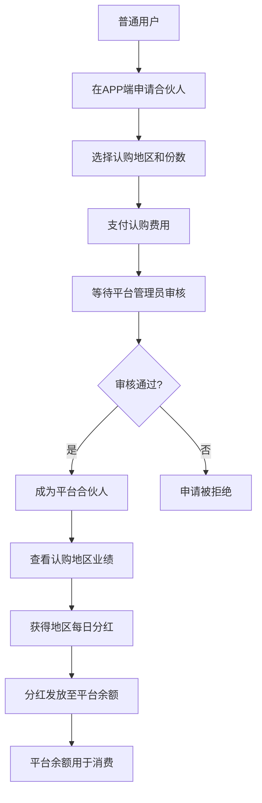
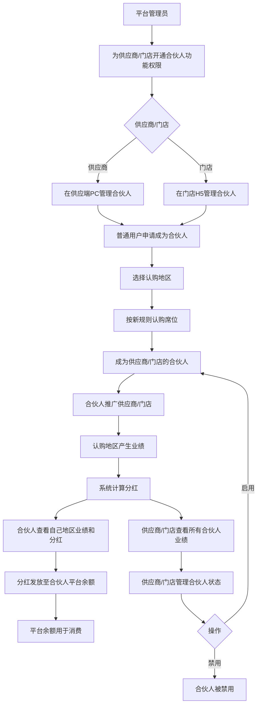

# 需求分析：供应商和门店合伙人功能

## 文档信息

| 字段 | 内容 |
|------|------|
| 需求名称 | 供应商和门店合伙人功能 |
| 文档版本 | V1.0 |
| 创建日期 | 2026-04-30 |
| 最后更新 | 2026-05-07 |
| 撰写人 | Jacky |
| 文档状态 | 草稿 |
| 关联沟通记录 | [供应商和门店合伙人功能-需求沟通记录-20260430.md](../01_discussions/供应商和门店合伙人功能-需求沟通记录-20260430.md) |

---

## 一、需求背景分析

### 1.1 当前业务现状

星码特平台目前已实现**平台合伙人功能**，面向所有会员群体开放：

- **认购方式**：按省/市/区地区认购合伙人席位，支付认购费用
- **分红机制**：获得认购地区的每日业务分红
- **管理端**：平台管理端可管理合伙人信息、查看收益统计、监控业务数据
- **用户端**：用户可在APP端申请合伙人、查询地区认购状态、查看合伙人权益和收益

### 1.2 业务痛点

当前平台合伙人功能存在以下局限性：

1. **推广主体单一**：仅平台自身推广，缺乏供应商和门店的主动参与
2. **激励机制不足**：供应商和门店无法通过发展合伙人获得额外收益
3. **业务增长受限**：无法调动供应商和门店的推广积极性，限制了平台业务扩展速度
4. **分红规则固化**：现有分红规则仅基于地区和份数，无法体现供应商和门店的差异化价值

### 1.3 业务机会

通过为供应商和门店提供合伙人功能，可以实现：

1. **多主体推广**：供应商和门店可自主发展合伙人，形成多层级推广网络
2. **利益绑定**：供应商/门店与其合伙人形成利益共同体，提升推广动力
3. **业务增长**：通过供应商和门店的渠道资源，快速扩大平台用户规模
4. **差异化分红**：基于供应商和门店的不同身份，设计更灵活的认购和分红规则

### 1.4 受影响的用户/角色

| 角色 | 影响说明 |
|------|----------|
| 平台管理员 | 需要为供应商/门店分配合伙人功能权限，管理多类型合伙人 |
| 供应商 | 可在供应端PC端发展和管理自己的合伙人，查看合伙人业绩 |
| 门店 | 可在门店H5发展和管理自己的合伙人，查看合伙人业绩 |
| 普通用户 | 可成为供应商/门店的合伙人，获得对应的地区分红 |

### 1.5 不做此需求的影响

- 供应商和门店缺乏推广动力，平台增长依赖单一渠道
- 无法充分利用供应商和门店的渠道资源和客户关系
- 竞争对手若提供类似功能，可能导致供应商和门店流失

---

## 二、需求目标确认

### 2.1 核心目标

为供应商和门店提供合伙人功能模块，允许其自主发展合伙人，通过合伙人推广获得业绩分红，形成"平台-供应商/门店-合伙人"的多层级推广体系。

### 2.2 期望成果

1. **平台端权限管理**：平台管理员可为指定供应商/门店开通合伙人功能，配置不同类型的认购规则
2. **供应端合伙人管理**：供应商可在供应端PC查看/管理名下合伙人、启用/禁用状态、查看合伙人业绩和汇总数据
3. **门店端合伙人管理**：门店可在门店H5查看/管理名下合伙人、启用/禁用状态、查看合伙人业绩和汇总数据
4. **用户端多身份展示**：用户可查看自己所有类型的合伙人身份（平台/供应商/门店），查看各身份下的认购地区业绩和分红明细
5. **合伙人申请与邀请**：用户可主动申请或接受邀请成为供应商/门店的合伙人

### 2.3 可衡量指标

- 开通合伙人功能的供应商/门店数量
- 供应商/门店发展的合伙人数量
- 合伙人产生的业绩和分红金额
- 合伙人推广带来的新增用户数

---

## 三、业务流程分析

### 4.1 当前流程（平台合伙人）



### 4.2 目标流程（供应商/门店合伙人）



### 4.3 流程对比说明

| 对比维度 | 平台合伙人 | 供应商/门店合伙人 |
|----------|------------|-------------------|
| 权限开通 | 无需开通，所有用户可申请 | 平台管理员手动为供应商/门店开通 |
| 申请入口 | 用户H5 | 供应商在供应端PC，门店在门店H5 |
| 认购规则 | 按地区认购，支付固定费用 | 按地区认购，但规则需升级优化 |
| 分红来源 | 认购地区的平台业绩 | 认购地区的供应商/门店业绩 |
| 管理主体 | 平台管理员 | 供应商/门店自主管理 |
| 数据查看 | 合伙人查看自己地区数据 | 供应商/门店查看所有合伙人数据，合伙人查看自己地区数据 |

---

## 四、功能拆解清单

### 4.1 平台管理端功能

**菜单位置**：`合伙人管理`（扩展）

| 模块 | 功能 | 功能描述 | 优先级 |
|------|------|----------|--------|
| 供应商管理 | 合伙人功能权限开通 | 为指定供应商开通合伙人功能模块权限 | should |
| 门店管理 | 合伙人功能权限开通 | 为指定门店开通合伙人功能模块权限 | should |
| 合伙人管理 | 供应商合伙人列表 | 查看所有供应商名下的合伙人列表和业绩数据（支持按供应商筛选） | Must |
| 合伙人管理 | 门店合伙人列表 | 查看所有门店名下的合伙人列表和业绩数据（支持按门店筛选） | Must |
| 系统配置 | 供应商合伙人认购规则配置 | 配置供应商合伙人的认购规则和分红规则 | should |
| 系统配置 | 门店合伙人认购规则配置 | 配置门店合伙人的认购规则和分红规则 | should |

### 4.2 供应端PC功能（供应商使用）

**菜单位置**：`新增"合伙人管理"菜单`

| 功能 | 功能描述 | 优先级 |
|------|----------|--------|
| 合伙人列表 | 展示名下所有合伙人（ID、昵称、手机号、认购地区、认购时间、状态），支持筛选查询；在列表中查看合伙人业绩数据（订单数量、订单金额、产生分红）；支持添加/编辑/启用/禁用操作 | Must |
| 合伙人业绩汇总 | 查看所有合伙人的累计业绩和分红统计 | Should |

### 4.3 门店H5功能（门店使用）

**菜单位置**：`"我的"页面新增"合伙人管理"入口`

| 功能 | 功能描述 | 优先级 |
|------|----------|--------|
| 合伙人列表 | 展示名下所有合伙人（基本信息、认购地区），支持筛选查询；在列表中查看合伙人业绩数据（订单数量、订单金额、产生分红）；支持添加/编辑/启用/禁用操作 | Must |
| 合伙人业绩汇总 | 查看所有合伙人的累计业绩和分红统计 | Should |

### 4.4 用户H5功能（合伙人使用）

**菜单位置**：`"合伙人中心"（扩展）、"合伙人申请"（扩展）`

| 功能 | 功能描述 | 优先级 |
|------|----------|--------|
| 合伙人身份列表 | 展示用户所有合伙人身份（平台合伙人+供应商合伙人+门店合伙人），支持切换/筛选查看 | Must |
| 合伙人身份详情 | 点击身份进入详情页，展示归属信息、认购地区、业绩数据、分红明细、平台余额 | Must |
| 合伙人申请 | 一个申请页面，包含三个入口：平台合伙人申请、供应商合伙人申请（选供应商→认购地区）、门店合伙人申请（选门店→认购地区） | Should |

### 4.5 功能清单（导出格式）

```
- 功能清单
  - 平台管理端
    - 供应商管理
      - 合伙人功能权限开通
    - 门店管理
      - 合伙人功能权限开通
    - 合伙人管理
      - 供应商合伙人列表
      - 门店合伙人列表
      - 合伙人类型筛选
    - 系统配置
      - 供应商合伙人认购规则配置
      - 门店合伙人认购规则配置
  - 供应端PC（供应商使用）
    - 合伙人管理
      - 合伙人列表
      - 合伙人业绩汇总
  - 门店H5（门店使用）
    - 合伙人管理
      - 合伙人列表
      - 合伙人业绩汇总
  - 用户H5（合伙人使用）
    - 合伙人中心
      - 合伙人身份列表
      - 合伙人身份详情
    - 合伙人申请
      - 合伙人申请（含三个入口）
```

---

## 五、待确认事项

| 序号 | 待确认事项 | 状态 | 结论/说明 |
|------|------------|------|--------|
| 1 | 供应商合伙人的具体认购规则 | ✅ 已确认 | 复用平台合伙人规则，新增"供应商合伙人"规则模板 |
| 2 | 门店合伙人的具体认购规则 | ✅ 已确认 | 复用平台合伙人规则，新增"门店合伙人"规则模板 |
| 3 | 供应商合伙人的分红计算规则 | ✅ 已确认 | 分红比例低于平台合伙人，来源为归属供应商在认购地区的业绩 |
| 4 | 门店合伙人的分红计算规则 | ✅ 已确认 | 分红比例低于平台合伙人，来源为归属门店在认购地区的业绩 |
| 5 | 供应商/门店合伙人的业绩数据范围 | ✅ 已确认 | 仅归属供应商/门店在认购地区的业绩（区别于平台合伙人查看全国业绩） |
| 6 | 合伙人申请流程 | ✅ 已确认 | 用户主动申请 + 供应商/门店邀请（生成邀请链接/二维码） |
| 7 | 一个用户同时成为多个供应商/门店的合伙人 | ✅ 已确认 | 允许，每个归属关系独立，需设计多归属身份列表展示 |
| 8 | 供应商/门店合伙人与平台合伙人的关系 | ✅ 已确认 | 可叠加，不互斥，三者独立计算分红 |
| 9 | 供应商/门店是否可以查看合伙人的详细个人信息 | ✅ 已确认 | 供应商/门店可查看：手机号、昵称/头像、认购时间、认购地区；不可查看：真实姓名、身份证号 |
| 10 | 合伙人被禁用后的处理逻辑 | ✅ 已确认 | 已产生分红不追溯；禁用后停发；可重新启用恢复 |

**确认原则**：
- 所有 Must 级别功能必须在 PRD 撰写前完成确认
- 未确认事项不得在 PRD 中编造，必须标注"待确认"

---

## 六、业务规则设计

### 6.1 分红规则

| 合伙人类型 | 分红比例 | 分红来源 | 分红周期 |
|------------|----------|----------|----------|
| 平台合伙人 | 平台统一配置 | 认购地区的全国业绩 | 每日 |
| 供应商合伙人 | 低于平台合伙人 | 归属供应商在认购地区的业绩 | 每日 |
| 门店合伙人 | 低于平台合伙人 | 归属门店在认购地区的业绩 | 每日 |

**规则说明**：
- 分红比例按供应商/门店类型差异化配置
- 分红比例按认购地区级别（省/市/区）差异化配置
- 支持按业绩阶梯配置递增的分红比例

### 6.2 认购规则配置

**配置层级结构**：

```
合伙人认购规则
│
├── 等级模板管理（可新增/编辑/删除）
│   ├── LP（等级1）
│   │   ├── 分红模式：平分 / 按份额
│   │   ├── 分红比例：X%
│   │   └── 份额数量：自定义（如10份）
│   ├── 1GP（等级2）
│   │   ├── 分红模式：平分 / 按份额
│   │   ├── 分红比例：X%
│   │   └── 份额数量：自定义（如10份）
│   └── 2GP（等级3）
│       ├── 分红模式：平分 / 按份额
│       ├── 分红比例：X%
│       └── 份额数量：自定义（如10份）
│
└── 地区配置（各等级通用地区池）
    ├── 广东省
    │   ├── 省级认购费：XXX元
    │   ├── 市级认购费：XXX元
    │   └── 区级认购费：XXX元
    ├── 广州市
    │   ├── 市级认购费：XXX元
    │   └── 区级认购费：XXX元
    └── 天河区
        └── 区级认购费：XXX元
```

**等级说明**：
- LP/1GP/2GP 为系统预设等级，支持将来自定义新增等级
- 各等级可独立配置分红模式和分红比例
- 等级门槛（认购费用）由供应商/门店线下与合伙人自行约定

**地区配置说明**：
- 地区池为各等级共用，供应商/门店可在后台配置各地区的认购费用
- 地区层级：省 → 市 → 区（下级包含于上级）
- 认购费由供应商/门店线下收取，平台仅记录归属关系

**分红模式**：
| 模式 | 说明 | 示例 |
|------|------|------|
| 平分 | 该等级下所有合伙人平均分配该地区分红 | 某日产生1000元，3个合伙人各得333.33元 |
| 按份额 | 按合伙人认购的份额数量比例分配 | 等级总份额10份，A认购3份，B认购7份，A得300元，B得700元 |

**按份额模式说明**：
- 供应商/门店在配置等级时自定义该等级的"总份额数量"
- 用户认购时选择认购份额数（1份起认购，最多不超过剩余份额）
- 分红 = 该地区当日分红总额 × (用户认购份额 / 等级总份额)

**认购流程**：
1. 用户选择供应商/门店
2. 选择合伙人等级（LP / 1GP / 2GP）
3. 系统展示该等级支持的地区列表和认购费
4. 用户选择地区，线下向供应商/门店交认购费
5. 平台记录归属关系（等级+地区），合伙人正式生效

### 6.3 分红资金池规则

**资金来源**：合伙人分红从供应商/门店每笔订单的分红比例中提留

| 分红来源 | 说明 |
|----------|------|
| 供应商订单 | 从供应商每笔订单的可分红金额中，按配置比例提留至合伙人分红池 |
| 门店订单 | 从门店每笔订单的可分红金额中，按配置比例提留至合伙人分红池 |

**分红计算**：每日根据归属供应商/门店在认购地区的业绩，计算合伙人应得分红，从分红池发放

### 6.4 业绩统计维度

| 统计维度 | 说明 |
|----------|------|
| 认购地区 | 该地区的新增用户、订单数量、订单金额 |
| 归属主体 | 该供应商/门店在认购地区的业绩数据 |
| 时间维度 | 今日/昨日/近7天/近30天/全部时间 |

### 6.5 数据权限边界

| 角色 | 可查看的数据范围 |
|------|------------------|
| 平台管理员 | 所有供应商/门店的合伙人汇总数据 |
| 供应商 | 仅查看自己发展的合伙人数据 |
| 门店 | 仅查看自己发展的合伙人数据 |
| 合伙人 | 仅查看自己认购地区的业绩和分红明细 |

---

## 七、异常流程处理

| 异常场景 | 处理逻辑 |
|----------|----------|
| 供应商/门店被强制下架 | 合伙人资格暂停，分红停发；合伙人状态变更为"已禁用" |
| 供应商/门店恢复上架 | 合伙人自动恢复资格和分红，无需重新申请 |

**说明**：本需求不涉及供应商/门店注销逻辑，暂不考虑此类异常。

---

## 八、下一步行动

1. **撰写PRD文档**：基于需求分析结果，撰写详细的PRD文档
2. **原型设计**：由UI/UX团队设计各端合伙人管理界面
3. **技术评审**：由技术团队评估实现方案