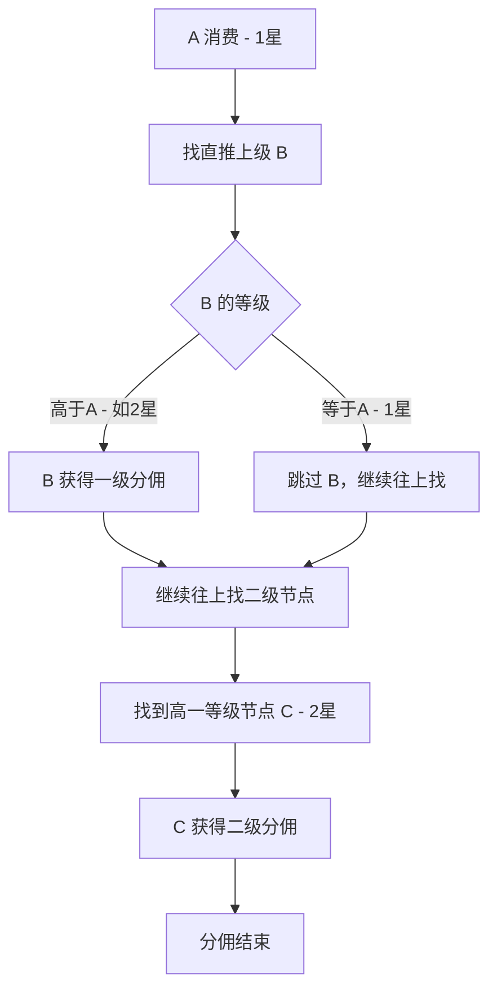
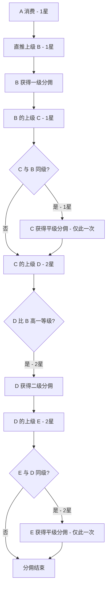
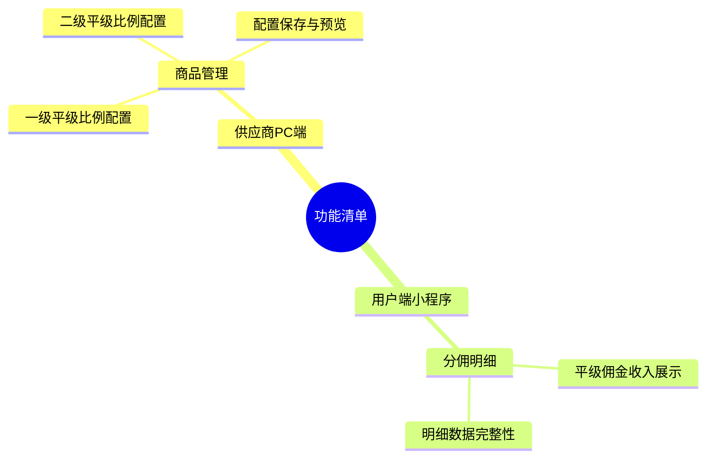

# 需求分析：平级分佣功能

## 文档信息

| 字段 | 内容 |
|------|------|
| 需求名称 | 平级分佣功能 |
| 文档版本 | V1.0 |
| 创建日期 | 2026-04-30 |
| 最后更新 | 2026-04-30 |
| 撰写人 | Jacky |
| 文档状态 | 草稿 |
| 关联沟通记录 | [平级分佣功能-需求沟通记录-20260430.md](../01_discussions/平级分佣功能-需求沟通记录-20260430.md) |

---

## 一、需求背景分析

### 1.1 当前分佣体系现状

星码特平台现有两种分佣模式：

**普通模式**：采用固定比例分佣，不区分会员等级，支持两级分佣（一级10%，二级0%）。适用于全平台统一推广激励场景。

**用户级别模式**：基于会员等级差异化分佣，细分4个用户层级（VIP、VIP1一星、VIP2二星、VIP3三星），管理员可为每个等级在一级和二级分佣中分别设置比例。

**现有用户级别模式分佣链路逻辑**：
- 沿推荐链路向上寻找上级节点
- 遇到比消费用户**高一等级**的节点，发放一次佣金
- 遇到**同等级**节点，跳过，继续往上找
- 找到**再高一等级**的节点，发放一次佣金
- 共发放两次，按等级上升逐级触发

### 1.2 业务痛点

在现有用户级别模式中，**同等级上级节点**始终无法获得佣金，导致：

1. **同级推广缺乏激励**：高等级用户横向发展同级用户后，同级用户的消费行为对其无任何佣金回报，积极性不足
2. **推广网络横向扩展动力弱**：用户更倾向于向下发展低等级用户（可获得一级佣金），而非横向发展同级用户
3. **佣金链路存在断层**：推荐链路中同级节点被完全跳过，部分有效推荐行为未得到任何激励

### 1.3 受影响的用户/角色

| 角色 | 影响说明 |
|------|----------|
| 供应商（管理员） | 需在商品管理中配置平级分佣比例 |
| 高等级会员 | 可获得同级下级用户消费带来的平级佣金 |
| 后端研发 | 分佣计算逻辑需升级，支持平级节点识别与佣金发放 |

### 1.4 不做此需求的影响

- 同等级用户之间的推广行为持续缺乏激励
- 高等级会员维护同级网络的动力不足，影响高等级用户活跃度
- 分销网络横向扩展受限，平台会员规模增长放缓

---

## 二、需求目标确认

### 2.1 核心目标

在用户级别模式的基础上，新增平级分佣规则，当分佣链路中存在与上一分佣节点**同等级**的上级时，给该同级上级发放一次平级佣金，以激励高等级会员横向扩展和维护同级推广网络。

### 2.2 期望成果

1. **平级节点可获佣金**：同级上级节点不再被完全跳过，可获得一次平级分佣
2. **灵活配置**：管理员可按会员等级分别设置平级分佣比例，并在一级和二级分佣中各自独立配置
3. **分佣明细可查**：用户端可查看平级佣金收入记录
4. **不影响现有逻辑**：平级分佣作为叠加规则，不改变原有一级/二级分佣的触发逻辑

### 2.3 可衡量指标

- 平级分佣功能上线后，同等级用户之间的推荐转化率变化
- 高等级会员横向发展同级用户的数量变化
- 平级佣金发放总金额及人均佣金金额

---

## 三、业务流程分析

### 3.1 当前流程（用户级别模式分佣链路）

以 A（1星）消费为例，沿推荐链路向上寻找分佣节点：

**核心问题**：同等级节点（如1星上级推荐了1星用户）被完全跳过，无任何佣金回报。

### 3.2 目标流程（新增平级分佣后的完整链路）

以 A（1星）消费、推荐链路为 A → B（1星）→ C（1星）→ D（2星）→ E（2星）→ F（3星）为例：

### 3.3 完整分佣链路说明

| 步骤 | 节点 | 等级 | 分佣类型 | 触发条件 | 备注 |
|------|------|------|----------|----------|------|
| 1 | B（直推上级） | 1星 | 一级分佣 | 直接推荐人 | 原有逻辑，正常触发 |
| 2 | C（B的上级） | 1星 | 平级分佣 | C 与 B 同级 | 新增逻辑，1星层级仅触发一次 |
| 3 | D（C的上级） | 2星 | 二级分佣 | D 比 B 高一等级 | 原有逻辑，正常触发 |
| 4 | E（D的上级） | 2星 | 平级分佣 | E 与 D 同级 | 新增逻辑，2星层级仅触发一次 |
| 5 | 结束 | - | - | - | - |

### 3.4 平级分佣触发规则

- **触发条件**：分佣链路中，某节点与其下方已分佣节点等级相同
- **触发上限**：每个会员等级层级只触发一次平级分佣（1星触发一次，2星触发一次，各自独立）
- **未设置则不触发**：该等级的平级分佣比例未配置或为0时，跳过该节点继续往上寻找
- **顺序**：先平级，再升级（即同级节点先触发，再继续寻找更高等级节点）

---

## 四、功能拆解清单

### 4.1 功能架构思维导图

---

### 4.2 功能详细清单

| 终端 | 模块 | 功能 | 功能描述 | 优先级 |
|------|------|------|----------|--------|
| 供应商PC | 商品管理 | 一级平级比例配置 | 按会员等级（VIP/1星/2星/3星等）分别设置一级分佣中的平级比例 | Must |
| 供应商PC | 商品管理 | 二级平级比例配置 | 按会员等级（VIP/1星/2星/3星等）分别设置二级分佣中的平级比例 | Must |
| 供应商PC | 商品管理 | 配置保存与预览 | 保存配置后，可预览当前各等级的完整分佣规则（含平级分佣） | Should |
| 用户小程序/H5 | 分佣明细 | 平级佣金收入展示 | 分佣明细列表中展示平级佣金收入记录，与一级/二级佣金合并展示为佣金收入 | Must |
| 用户小程序/H5 | 分佣明细 | 明细数据完整性 | 确保平级佣金记录包含来源用户、消费金额、佣金金额、发放时间等基本信息 | Must |

> **后端改造说明**：分佣链路计算逻辑升级、平级佣金数据存储方案详见PRD文档"系统改造"部分。

---

## 五、待确认事项

| 序号 | 待确认事项 | 状态 | 确认方案 |
|------|------------|------|----------|
| 1 | 平级分佣比例的计算基数：以**消费金额**为基准还是以**一级佣金金额**为基准 | ~~待确认~~ 已确认 | **方案A**：以消费金额为基准（与其他分佣保持一致口径） |
| 2 | 平级分佣比例是否有上限限制（如单个等级平级比例不超过多少%） | ~~待确认~~ 已确认 | **方案A**：不设上限，比例可配置0-100%任意值 |
| 3 | 是否需要在管理端设置平级分佣的**全局开关**（平台层面统一控制） | ~~待确认~~ 已确认 | **方案B**：不需要全局开关，仅依靠供应商在商品管理中配置来决定是否启用 |
| 4 | 链路中若某等级无同级上级节点（即平级节点不存在），是否直接跳过继续向上寻找，还是有其他逻辑 | ~~待确认~~ 已确认 | **方案A**：直接跳过，继续向上寻找更高级别节点分佣 |
| 5 | 用户端分佣明细是否需要在备注或标签中区分"平级佣金"的来源说明（即使前端合并展示，是否需要用户知晓） | ~~待确认~~ 已确认 | **方案A**：不区分，统一显示为"佣金收入"，仅在金额上体现 |
