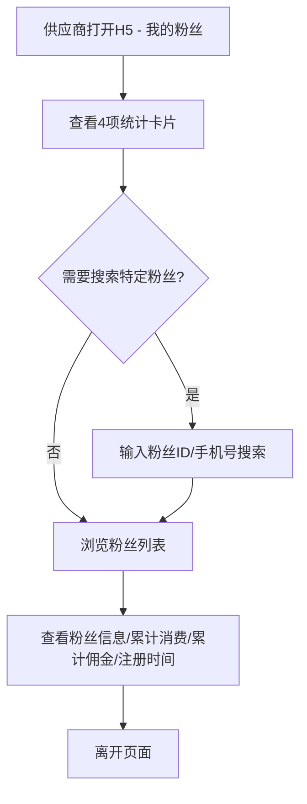
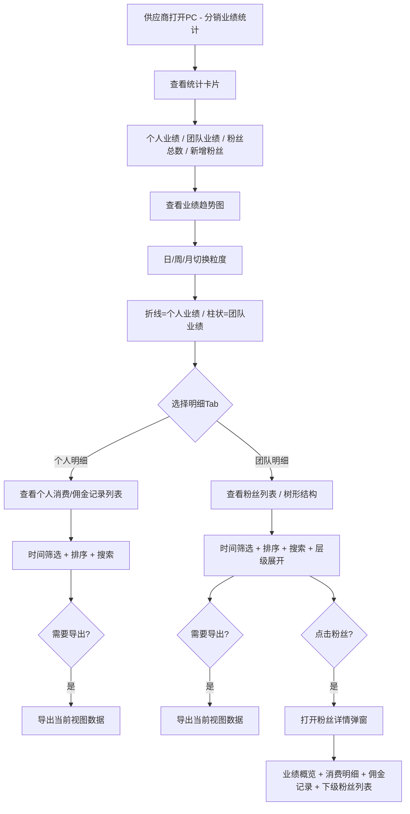

# 需求分析：分销业绩统计（供应商PC端）

## 文档信息

| 字段 | 内容 |
|------|------|
| 需求名称 | 分销业绩统计（供应商PC端） |
| 文档版本 | V1.0 |
| 创建日期 | 2026-05-12 |
| 最后更新 | 2026-05-12 |
| 撰写人 | Jacky |
| 文档状态 | 草稿 |
| 关联沟通记录 | [分销业绩统计-需求沟通记录-20260512.md](../01_discussions/分销业绩统计-需求沟通记录-20260512.md) |

---

## 一、需求背景分析

### 1.1 当前业务现状

星码特平台用户端H5已有"我的粉丝"模块，供应商可在H5端查看通过推广链接/邀请码注册的用户数据：

**H5端现有功能**：
- 4项统计指标卡片：粉丝总数、累计粉丝、粉丝总业绩、个人总业绩
- 搜索功能：按粉丝ID/手机号搜索
- 粉丝列表：粉丝信息（头像/昵称/手机号）、累计消费、累计佣金、注册时间

**H5端局限**：
- 仅展示4项基础统计，缺乏趋势分析和对比能力
- 列表仅4列，无法展示团队人数、消费频次、客单价等深度数据
- 无团队层级结构，供应商无法了解分销网络的广度和深度
- 无时间筛选、数据导出、图表分析等PC端常见管理能力
- 页面信息密度低，适合快速查看但不适合深度管理

### 1.2 业务痛点

1. **团队结构不可见**：供应商不知道粉丝之间的层级关系，无法识别关键推广节点和高价值团队成员
2. **业绩分析能力弱**：缺乏时间维度对比和趋势分析，无法判断团队业绩是增长还是衰退
3. **数据管理效率低**：无法导出数据、无法按多条件筛选排序，运营管理靠手工
4. **个人与团队割裂**：H5端"个人总业绩"和"粉丝总业绩"混在一起，没有形成清晰的双维度对比

### 1.3 业务机会

1. **团队透视**：通过树形结构让供应商清晰看到分销网络全貌，识别高价值推广者
2. **数据驱动管理**：趋势图表和层级拆解帮助供应商做出激励决策，提升团队整体产出
3. **效率提升**：筛选、排序、导出能力让供应商从"看数据"升级为"用数据"

### 1.4 受影响的用户/角色

| 角色 | 影响说明 |
|------|----------|
| 供应商 | 在PC端查看分销团队结构和业绩数据，进行数据驱动的团队管理 |
| 推广专员/粉丝 | 无直接操作，但供应商的管理决策间接影响其激励和收益 |

### 1.5 不做此需求的影响

- 供应商缺乏团队管理工具，分销网络扩展依赖直觉而非数据
- 无法识别和激励高价值推广者，团队活跃度和产出增长受限
- H5端功能过于简单，无法满足规模化团队管理需求

---

## 二、需求目标确认

### 2.1 核心目标

在供应商PC端新增"分销业绩统计"独立模块，按**粉丝总业绩**和**个人总业绩**双维度组织，提供业绩统计数据、粉丝业绩趋势图表、粉丝业绩明细列表和详情等完整的数据管理和分析能力。

### 2.2 期望成果

**供应商端**：
1. 进入页面即可看到个人/团队双维度核心统计指标
2. 通过趋势图直观了解业绩变化（日/周/月切换）
3. 通过Tab切换查看"个人明细"和"团队明细"
4. 团队明细支持树形结构展示最多3级粉丝关系
5. 点击粉丝可查看完整详情（业绩概览、消费明细、佣金记录、下级粉丝）
6. 支持时间筛选、多条件排序、搜索、导出当前视图数据

### 2.3 可衡量指标

- 供应商使用"分销业绩统计"模块的日活跃度
- 团队业绩数据查看频率（页面PV）
- 数据导出操作次数
- 粉丝详情页访问深度

---

## 三、业务流程分析

### 3.1 当前流程（H5端）



**当前流程特征**：线性浏览，无筛选、无层级、无图表、无详情钻取。

### 3.2 目标流程（PC端）



### 3.3 流程对比

| 对比维度 | H5端（现状） | PC端（目标） |
|----------|-------------|-------------|
| 统计指标 | 4项（粉丝总数/累计粉丝/粉丝总业绩/个人总业绩） | 4项 + 趋势图（个人业绩/团队业绩/粉丝总数/新增粉丝） |
| 数据维度 | 单一列表 | 双维度：个人明细Tab + 团队明细Tab |
| 列表字段 | 4列 | 10+列完整数据 |
| 团队层级 | 无 | 树形结构，最多3级 |
| 时间筛选 | 无 | 今日/昨日/近7天/近30天/自定义 |
| 图表 | 无 | 趋势折线+柱状图，日/周/月切换 |
| 粉丝详情 | 无 | 弹窗：业绩+消费+佣金+下级 |
| 数据导出 | 无 | 导出当前视图 |
| 排序搜索 | 仅ID/手机号搜索 | 多条件排序 + 组合筛选 + 搜索 |

---

## 四、功能拆解清单

### 4.1 供应商PC端功能

**菜单位置**：`供应端 > 分销业绩统计`（新增独立一级菜单）

#### 4.1.1 统计概览区

| 功能 | 功能描述 | 优先级 |
|------|----------|--------|
| 核心指标卡片 | 4张统计卡片：粉丝总业绩（元）、个人总业绩（元）、粉丝总数（人）、种子粉丝数（人）、新增粉丝数（人）。数据实时更新 | Must |
| 业绩趋势图 | 折线图展示粉丝总业绩和个人总业绩趋势，双维度叠加在同一图表中；支持按日/按周/按月切换时间粒度；支持自定义时间范围 | Must |

#### 4.1.2 我的种子粉丝

| 功能 | 功能描述 | 优先级 |
|------|----------|--------|
| 种子粉丝列表 | 表格展示所有种子粉丝，数据列：用户ID、粉丝信息（头像/昵称/手机号）、种子粉丝数、粉丝总业绩、个人总业绩、红包券、消费积分、消费券、注册时间 | Must |
| 排序 | 支持按注册时间、种子粉丝、粉丝总业绩、个人总业绩等多字段排序 | Must |
| 搜索 | 支持按用户ID或手机号搜索 | Must |
| 导出数据 | 导出当前筛选条件下的列表数据为Excel格式，字段与列表一致 | Must |
| 分页组件 | 默认10条，支持按不同页数展示粉丝列表数据 | Must |

#### 4.1.4 粉丝详情弹窗

| 功能 | 功能描述 | 优先级 |
|------|----------|--------|
| 粉丝信息展示 | 该粉丝的信息展示列表（头像/昵称、手机号码、性别、注册时间） | Must |
| 粉丝业绩展示 | 展示该粉丝的粉丝总业绩（元）、个人总业绩（元）、粉丝总数（人）、种子粉丝数（人）等核心指标 | Must |


### 4.2 功能清单（导出格式）

```
- 功能清单
  - 供应商PC端
    - 分销业绩统计（新增独立菜单）
      - 统计概览区
        - 核心指标卡片（个人业绩/团队业绩/粉丝总数/新增粉丝）
        - 业绩趋势图（日/周/月切换，个人折线+团队柱状）
      - 个人明细Tab
        - 消费佣金记录列表
        - 时间筛选 + 排序搜索
      - 团队明细Tab
        - 粉丝列表（含层级结构，最多3级树形展开）
        - 时间筛选 + 多字段排序 + 搜索
        - 数据导出（Excel）
      - 粉丝详情弹窗
        - 业绩概览
        - 消费订单明细
        - 佣金记录
        - 下级粉丝列表
```

---

## 五、待确认事项

本需求所有事项已在沟通阶段全部确认完毕，无遗留待确认项。

| 序号 | 事项 | 结论 |
|------|------|------|
| 1 | 图表展示维度 | 日/周/月切换，折线(个人)+柱状(团队)双维度叠加 |
| 2 | 粉丝详情页内容 | 完整详情：业绩概览 + 消费订单明细 + 佣金记录 + 下级粉丝列表 |
| 3 | 数据导出范围 | 导出当前筛选视图数据，字段与列表一致 |
| 4 | 层级深度 | 最多3级（粉丝→子粉丝→孙粉丝） |
| 5 | 数据时效 | 实时计算，消费后立即更新 |
| 6 | 消息触达 | 不需要 |
| 7 | 行为数据 | 仅交易数据，不包含非交易行为 |

---

## 六、业务规则设计

### 6.1 团队层级规则

| 规则项 | 说明 |
|--------|------|
| 层级定义 | 通过供应商邀请码直接注册的用户为**一级粉丝**；一级粉丝邀请注册的用户为**二级粉丝**；以此类推 |
| 展示深度 | PC端最多展示3级，更深层级折叠不展示 |
| 业绩归属 | 粉丝的消费业绩归属于其直接邀请人，同时向上汇总至供应商的团队总业绩中 |
| 层级统计 | 团队明细Tab中，每行粉丝标注"所属层级"（一级/二级/三级） |

### 6.2 业绩计算规则

| 计算项 | 计算口径 |
|--------|----------|
| 个人业绩 | 供应商自身在平台上的消费总额 + 获得的佣金总额 |
| 团队业绩 | 所有下级粉丝（1~3级）的消费总额汇总 |
| 粉丝总数 | 所有下级粉丝（1~3级）的去重人数 |
| 新增粉丝数 | 选定时间范围内新注册的下级粉丝人数 |
| 团队人数 | 该粉丝自身发展的下级粉丝人数（在粉丝列表中展示） |
| 团队业绩 | 该粉丝自身 + 其下级粉丝的消费总额（在粉丝列表中展示） |
| 消费频次 | 选定时间范围内该粉丝的消费订单数 |
| 客单价 | 该粉丝累计消费总额 / 累计消费订单数 |

### 6.3 数据统计维度

| 维度 | 说明 |
|------|------|
| 时间维度 | 今日 / 昨日 / 近7天 / 近30天 / 自定义范围 |
| 层级维度 | 一级粉丝 / 二级粉丝 / 三级粉丝 |
| 排序维度 | 累计消费 / 累计佣金 / 团队业绩 / 注册时间 / 最近消费时间 |
| 导出维度 | 当前筛选条件下的列表数据 |

### 6.4 页面交互规则

| 交互 | 规则 |
|------|------|
| 默认视图 | 进入页面默认展示"团队明细"Tab，时间范围默认"近30天" |
| 树形展开 | 默认折叠，点击展开箭头展开下一级；最多展开3级 |
| 粉丝详情 | 点击粉丝行任意位置，弹出详情弹窗（Modal），宽度800px |
| 图表联动 | 切换日/周/月粒度时，图表和统计数据同步刷新 |
| 导出按钮 | 位于团队明细Tab列表上方工具栏，导出格式为 `.xlsx` |

---

## 七、下一步行动

1. **PRD撰写**：基于本需求分析文档，撰写完整PRD文档（`workspace/03_prd/分销业绩统计-PRD.md`）
2. **PC端Demo开发**：在 `web_new/pc` 项目中新增"分销业绩统计"页面和mock数据
3. **UI设计**：设计统计卡片、趋势图、树形列表、详情弹窗的具体视觉方案
