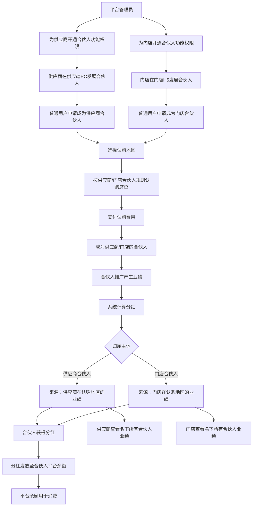

# PRD 产品需求文档：供应商和门店合伙人功能

## 文档信息

| 字段 | 内容 |
|------|------|
| 需求名称 | 供应商和门店合伙人功能 |
| 文档版本 | V1.0 |
| 创建日期 | 2026-05-08 |
| 产品经理 | Jacky |
| 关联需求分析 | ../02_spec/04.供应商和门店合伙人功能方案.md |

---

## 一、需求背景

星码特平台目前已实现**平台合伙人功能**，面向所有会员群体开放，支持按省/市/区地区认购合伙人席位并获得认购地区的每日业务分红。

当前平台合伙人功能存在以下局限性：
1. **推广主体单一**：仅平台自身推广，缺乏供应商和门店的主动参与
2. **激励机制不足**：供应商和门店无法通过发展合伙人获得额外收益
3. **业务增长受限**：无法调动供应商和门店的推广积极性，限制了平台业务扩展速度
4. **分红规则固化**：现有分红规则仅基于地区和份数，无法体现供应商和门店的差异化价值

通过为供应商和门店提供合伙人功能，允许其自主发展合伙人，通过合伙人推广获得业绩分红，形成"平台-供应商/门店-合伙人"的多层级推广体系。

---

## 二、需求目标

1. **平台端权限管理**：平台管理员可为指定供应商/门店开通合伙人功能，配置不同类型的认购规则
2. **供应端合伙人管理**：供应商可在供应端PC查看/管理名下合伙人、启用/禁用状态、查看合伙人业绩和汇总数据
3. **门店端合伙人管理**：门店可在门店H5查看/管理名下合伙人、启用/禁用状态、查看合伙人业绩和汇总数据
4. **用户端多身份展示**：用户可查看自己所有类型的合伙人身份（平台/供应商/门店），查看各身份下的认购地区业绩和分红明细
5. **合伙人申请与邀请**：用户可主动申请或接受邀请成为供应商/门店的合伙人

**可衡量指标**：
- 开通合伙人功能的供应商/门店数量
- 供应商/门店发展的合伙人数量
- 合伙人产生的业绩和分红金额
- 合伙人推广带来的新增用户数

---

## 三、需求核心业务流程图



---

## 四、需求功能清单

### 4.1 功能架构思维导图

```markdown
- 功能清单
  - 星码特管理后台
    - 商城管理
      - 线下商家管理
        - 营业中-开通合伙人功能
      - 线上店铺列表
        - 营业中-开通合伙人功能
    - 会员管理
      - 合伙人管理
        - 供应商合伙人
        - 门店合伙人
      - 合伙人规则配置
        - 供应商合伙人规则配置
        - 门店合伙人规则配置
  - 供应端PC
    - 合伙人管理
      - 合伙人列表
  - 门店H5
    - 合伙人管理
      - 合伙人列表
  - 用户H5
    - 合伙人中心
      - 合伙人身份列表
      - 合伙人身份详情
    - 合伙人申请
      - 供应商合伙人申请
      - 门店合伙人申请
```

### 4.2 功能详细清单

| 序号 | 终端 | 模块 | 功能 | 描述 | 优先级 |
|------|------|------|------|------|--------|
| 1 | 平台管理后台 | 商城管理-线下商家管理 | 开通合伙人功能 | 在供应商列表中增加开通合伙人按钮，点击弹出确认框，确定后开通 | Should |
| 2 | 平台管理后台 | 商城管理-线上店铺列表 | 开通合伙人功能 | 在门店列表中增加开通合伙人按钮，点击弹出确认框，确定后开通 | Should |
| 3 | 平台管理后台 | 会员管理 | 合伙人管理 | 查看所有供应商/门店名下的合伙人列表（Tab切换：供应商合伙人/门店合伙人，支持按归属供应商/门店、状态筛选） | Must |
| 4 | 平台管理后台 | 合伙人规则配置 | 供应商合伙人规则配置 | 配置LP/1GP/2GP等级的分红比例、分红模式（默认平分，可选按份额）、认购份额，以及省/市/区/街道各级别分红比例 | Should |
| 5 | 平台管理后台 | 合伙人规则配置 | 门店合伙人规则配置 | 配置LP/1GP/2GP等级的分红比例、分红模式（默认平分，可选按份额）、认购份额，以及省/市/区/街道各级别分红比例 | Should |
| 7 | 供应端PC | 合伙人管理 | 合伙人列表 | 展示名下所有合伙人，支持筛选查询、状态管理、业绩查看 | Must |
| 8 | 门店H5 | 合伙人管理 | 合伙人列表 | 展示名下所有合伙人，支持筛选查询、状态管理、业绩查看 | Must |
| 9 | 用户H5 | 合伙人中心 | 合伙人身份列表 | 展示用户所有合伙人身份（平台+供应商+门店） | Must |
| 10 | 用户H5 | 合伙人中心 | 合伙人身份详情 | 展示合伙人归属信息、认购地区、业绩数据、分红明细、平台余额 | Must |
| 11 | 用户H5 | 合伙人申请 | 供应商合伙人申请 | 选择供应商→选择等级→选择地区→线下确认，完成供应商合伙人申请 | Should |
| 12 | 用户H5 | 合伙人申请 | 门店合伙人申请 | 选择门店→选择等级→选择地区→线下确认，完成门店合伙人申请 | Should |

---

## 五、需求功能详述

#### 5.1 平台管理后台——商城管理——线下商家管理——开通合伙人功能

**原型描述**：
供应商列表页增加"合伙人功能"列，展示开通/未开通状态，操作列有"开通"按钮。点击"开通"按钮弹出确认弹窗。

```
┌─────────────────────────────────────────────────────────────────────┐
│  线下商家管理                                              [搜索]  │
├─────────────────────────────────────────────────────────────────────┤
│  商家名称      │ 商家类型 │ 地区    │ 联系人 │ 合伙人功能 │ 操作   │
├─────────────────────────────────────────────────────────────────────┤
│  深圳市XX公司  │ 源头供应商│ 深圳市  │ 张三   │ 已开通     │[关闭]  │
│  广州市XX公司  │ 渠道供应商│ 广州市  │ 李四   │ 未开通     │[开通]  │
│  ...          │ ...      │ ...     │ ...    │ ...        │ ...    │
└─────────────────────────────────────────────────────────────────────┘

┌─────────────────────────────────────────────────────────────┐
│                    开通合伙人功能                        [x] │
├─────────────────────────────────────────────────────────────┤
│                                                             │
│  确认开通"广州市XX公司"的合伙人功能？                      │
│                                                             │
│  开通后，该供应商可在供应端PC使用合伙人管理功能，           │
│  包括发展合伙人、管理合伙人状态、查看合伙人业绩等。         │
│                                                             │
│                                                             │
│  [取 消]                              [确认开通]           │
└─────────────────────────────────────────────────────────────┘
```

**用户故事**：
> 作为一个平台管理员，我想要为优质供应商开通合伙人功能，以便于他们发展自己的合伙人网络。

**前置条件**：
- 平台管理员已登录
- 当前供应商状态为"已认证"

**核心逻辑**：
- 点击"开通"后，弹出确认框，提示功能权限内容
- 开通后，供应商可在供应端PC使用合伙人管理功能

**边界条件与异常处理**：
- 供应商已被强制下架时，"开通"按钮禁用，提示"该供应商已下架"
- 重复点击"开通"时，提示"该供应商已开通合伙人功能"

**验收标准 (Acceptance Criteria)**：
- 🎯 **成功场景**：点击"开通"按钮，弹出确认框，确认后供应商状态变更为"已开通"
- ❌ **异常场景**：供应商已下架时，开通按钮禁用，不可点击

---

#### 5.2 平台管理后台——商城管理——线上店铺列表——开通合伙人功能

**原型描述**：
门店列表页增加"合伙人功能"列，展示开通/未开通状态，操作列有"开通"按钮。点击"开通"按钮弹出确认弹窗。

```
┌─────────────────────────────────────────────────────────────────────┐
│  线上店铺列表                                              [搜索]  │
├─────────────────────────────────────────────────────────────────────┤
│  店铺名称      │ 所属供应商 │ 地区    │ 合伙人功能 │ 操作          │
├─────────────────────────────────────────────────────────────────────┤
│  天河区XX门店 │ 深圳市XX公司│ 广州市  │ 已开通     │[关闭]        │
│  宝安区XX门店 │ 深圳市XX公司│ 深圳市  │ 未开通     │[开通]        │
│  ...          │ ...        │ ...     │ ...        │ ...           │
└─────────────────────────────────────────────────────────────────────┘

┌─────────────────────────────────────────────────────────────┐
│                    开通合伙人功能                        [x] │
├─────────────────────────────────────────────────────────────┤
│                                                             │
│  确认开通"宝安区XX门店"的合伙人功能？                     │
│                                                             │
│  开通后，该门店可在门店H5使用合伙人管理功能，               │
│  包括发展合伙人、管理合伙人状态、查看合伙人业绩等。         │
│                                                             │
│                                                             │
│  [取 消]                              [确认开通]           │
└─────────────────────────────────────────────────────────────┘
```

**用户故事**：
> 作为一个平台管理员，我想要为优质门店开通合伙人功能，以便于他们发展自己的合伙人网络。

**前置条件**：
- 平台管理员已登录
- 当前门店状态为"已认证"

**核心逻辑**：
- 点击"开通"后，弹出确认框，提示功能权限内容
- 开通后，门店可在门店H5使用合伙人管理功能

**边界条件与异常处理**：
- 门店已被强制下架时，"开通"按钮禁用，提示"该门店已下架"

**验收标准 (Acceptance Criteria)**：
- 🎯 **成功场景**：点击"开通"按钮，确认后门店状态变更为"已开通"
- ❌ **异常场景**：门店已下架时，开通按钮禁用，不可点击

---

#### 5.3 平台管理后台——会员管理——合伙人管理

**原型描述**：
供应商合伙人列表页，支持按供应商/状态筛选，列表展示合伙人基础信息和业绩数据。页面右上角有"添加合伙人"按钮。

```
┌─────────────────────────────────────────────────────────────────────────┐
│  供应商合伙人管理                      [+ 添加合伙人]      [筛选] [导出]│
├─────────────────────────────────────────────────────────────────────────┤
│  供应商：[全部 ▼]                              状态：[全部 ▼]          │
├─────────────────────────────────────────────────────────────────────────┤
│  昵称  │ 手机号   │ 归属供应商 │ 归属地区 │ 代理级别 │ 认购份数 │ 认购费 │ 认购时间 │ 操作                │
├─────────────────────────────────────────────────────────────────────────┤
│  张三  │ 138xxxx │ 深圳市XX公司│ 广东省   │ 1GP     │ 3份     │ ¥3,000 │2026-05-01│[编辑][禁用][收益明细]│
│  李四  │ 139xxxx │ 深圳市XX公司│ 广州市   │ LP      │ 5份     │ ¥2,500 │2026-05-03│[编辑][禁用][收益明细]│
│  王五  │ 137xxxx │ 广州市XX公司│ 深圳市   │ 2GP     │ 2份     │ ¥4,000 │2026-05-05│[编辑][禁用][收益明细]│
└─────────────────────────────────────────────────────────────────────────┘

┌─────────────────────────────────────────────────────────────────────────┐
│  添加供应商合伙人                                                    [x] │
├─────────────────────────────────────────────────────────────────────────┤
│  归属供应商：[请选择供应商 ▼]                                        │
│                                                                         │
│  会员查询：                                                         │
│  ┌───────────────────────────────────────────────────────────────────┐ │
│  │ 会员编号/手机号：[________________________]          [查询]      │ │
│  └───────────────────────────────────────────────────────────────────┘ │
│                                                                         │
│  查询结果：                                                         │
│  ┌───────────────────────────────────────────────────────────────────┐ │
│  │ 会员编号：100001  昵称：张三  手机号：138xxxx8888  已认证 ✓     │ │
│  └───────────────────────────────────────────────────────────────────┘ │
│                                                                         │
│  代理级别：[请选择级别 ▼]                                             │
│                                                                         │
│  归属地区：[请选择地区 ▼]                                             │
│                                                                         │
│  认购份数：[________________________] 份                               │
│                                                                         │
│  认购金额：[________________________] 元                               │
│                                                                         │
│  状态：    [○ 启用  ● 禁用]                                           │
│                                                                         │
│  [取 消]                                      [确认添加]               │
└─────────────────────────────────────────────────────────────────────────┘
```

**用户故事**：
> 作为一个平台管理员，我想要查看所有供应商名下的合伙人列表和业绩数据，以便于监控整体合伙人运营状况。

**前置条件**：
- 平台管理员已登录

**核心逻辑**：
- 默认展示全部供应商的合伙人列表
- 支持按"供应商名称"筛选
- 支持按"状态"筛选（正常/已禁用）
- **添加合伙人**：平台管理员通过会员编号/手机号查询会员信息，确认后将此会员设置为合伙人（适用于线下已付款但系统未记录的场景）
- 操作说明：
  - **编辑**：修改合伙人的基本信息（如归属地区）
  - **禁用**：暂停合伙人分红资格
  - **收益明细**：查看该合伙人的业绩和分红明细

**收益明细弹窗**：
点击"收益明细"按钮，弹出收益明细弹窗，展示该合伙人的收益记录。

```
┌─────────────────────────────────────────────────────────────────────────────────────────────┐
│  收益明细                                                                        [x]        │
├─────────────────────────────────────────────────────────────────────────────────────────────┤
│                                                                                             │
│  ┌─────────────────────────────────────────────────────────────────────────────────────────┐│
│  │  [冻结红包]  [红包]  [冻结余额]  [余额]                                                  ││
│  └─────────────────────────────────────────────────────────────────────────────────────────┘│
│                                                                                             │
│  ┌─────────────────────────────────────────────────────────────────────────────────────────┐│
│  │  获得时间： [2026-04-01] 至 [2026-05-08]                           [重置]    [查询]      ││
│  └─────────────────────────────────────────────────────────────────────────────────────────┘│
│                                                                                             │
│  ┌─────────────────────────────────────────────────────────────────────────────────────────┐│
│  │ 序号 │ 时间           │ 用户昵称 │ 用户账号      │ 类型  │ 订单编号       │ 交易前  │ 交易金额  │ 交易后  ││
│  ├──────┼───────────────┼──────────┼───────────────┼───────┼────────────────┼─────────┼───────────┼─────────┤│
│  │  1  │ 2026-05-07 10:00 │ 张三    │ 138****1234   │ 红包  │ ORD2026050701  │ 99.00   │  +10.00   │ 109.00  ││
│  ├──────┼───────────────┼──────────┼───────────────┼───────┼────────────────┼─────────┼───────────┼─────────┤│
│  │  2  │ 2026-05-07 10:05 │ 李四    │ 139****5678   │ 余额  │ ORD2026050702  │ 200.00  │  +50.00   │ 250.00  ││
│  └──────┴───────────────┴──────────┴───────────────┴───────┴────────────────┴─────────┴───────────┴─────────┘│
│                                                                                             │
│  共90条                                            < 1  2  3  ...  9  >        跳转[    ]│
└─────────────────────────────────────────────────────────────────────────────────────────────┘
```

**边界条件与异常处理**：
- 筛选条件下无数据时，显示"暂无数据"
- 归属供应商被下架时，合伙人状态显示"已禁用"
- 查询会员不存在时，提示"未找到该会员"
- 该会员已是该供应商合伙人时，提示"该会员已是此供应商的合伙人"

**验收标准 (Acceptance Criteria)**：
- 🎯 **成功场景**：页面加载默认展示全部合伙人列表；按供应商筛选后，仅显示该供应商的合伙人
- ✔️ **校验场景**：选择"状态=已禁用"筛选，仅显示已禁用的合伙人；手机号已存在时提示"该手机号已是合伙人"
- ❌ **异常场景**：网络异常时，显示错误提示，提供重试按钮

---

---

#### 5.5 平台管理后台——合伙人规则配置——供应商合伙人规则配置

**原型描述**：
合伙人规则配置页包含两个Tab按钮切换：供应商合伙人规则配置、门店合伙人规则配置。每个配置页仅包含等级配置（卡片式竖版布局），无地区配置。

```
┌─────────────────────────────────────────────────────────────────────┐
│  合伙人规则配置                                          [保存]     │
├─────────────────────────────────────────────────────────────────────┤
│  ┌───────────────────────────┐ ┌───────────────────────────┐       │
│  │ ● 供应商合伙人规则配置   │ │ ○ 门店合伙人规则配置     │       │
│  └───────────────────────────┘ └───────────────────────────┘       │
├─────────────────────────────────────────────────────────────────────┤
│  ┌───────────────────────────┐ ┌───────────────────────────┐       │
│  │ ● 等级配置               │ │ ○ 地区配置               │       │
│  └───────────────────────────┘ └───────────────────────────┘       │
├─────────────────────────────────────────────────────────────────────┤
│  等级配置（LP/1GP/2GP固定三个等级，不可新增）                       │
│  ┌───────────────────────────────────────────────────────────────────────────┐ │
│  │ 等级 │ 分红模式 │ 省级分红 │ 市级分红 │ 区级分红 │ 街道分红 │ 总份额 │ 操作         │ │
│  ├───────────────────────────────────────────────────────────────────────────┤ │
│  │ LP   │ 平分     │ 8%       │ 5%       │ 3%       │ 1%       │ 10    │ [编辑]       │ │
│  │ 1GP  │ 按份额   │ 10%      │ 8%       │ 5%       │ 2%       │ 10    │ [编辑]       │ │
│  │ 2GP  │ 按份额   │ 12%      │ 10%      │ 6%       │ 3%       │ 10    │ [编辑]       │ │
│  └───────────────────────────────────────────────────────────────────────────┘ │
└─────────────────────────────────────────────────────────────────────┘

┌─────────────────────────────────────────────────────────────┐
│  地区配置（省/市/区/街道固定四级结构）                            │
│  ┌─────────────────────────────────────────────────────────────────┐   │
│  │ 地区名称 │ 省级认购费 │ 市级认购费 │ 区级认购费 │ 街道认购费   │   │
│  ├─────────────────────────────────────────────────────────────────┤   │
│  │ 广东省   │ ¥5,000    │ ¥3,000    │ ¥1,000    │ ¥500         │   │
│  │ 广州市   │ -         │ ¥3,000    │ ¥1,000    │ ¥500         │   │
│  │ 天河区   │ -         │ -         │ ¥1,000    │ ¥500         │   │
│  │ 天河街道 │ -         │ -         │ -         │ ¥500         │   │
│  └─────────────────────────────────────────────────────────────────┘   │
└─────────────────────────────────────────────────────────────────────┘

┌─────────────────────────────────────────────────────────────┐
│  编辑等级                                            [x]     │
├─────────────────────────────────────────────────────────────┤
│  等级：LP（不可修改）                                               │
│  分红模式：[平分 ▼]                                                │
│  ┌───────────────────────────────────────────────────────────────┐   │
│  │ 地区级别 │ 分红比例                                            │   │
│  │ 省级     │ [8%________________________________]              │   │
│  │ 市级     │ [5%________________________________]              │   │
│  │ 区级     │ [3%________________________________]              │   │
│  │ 街道     │ [1%________________________________]              │   │
│  └───────────────────────────────────────────────────────────────┘   │
│  总份额数：[10 ________________________________] (份)              │
│                                                                        │
│  [取 消]                                    [保存]                   │
└─────────────────────────────────────────────────────────────┘
```

**用户故事**：
> 作为一个平台管理员，我想要配置供应商合伙人的等级规则，以便于供应商合伙人有规则可依。

**前置条件**：
- 平台管理员已登录

**核心逻辑**：
- **等级配置**：
  - 等级固定为LP/1GP/2GP三个，不可新增/删除
  - 每个等级配置：分红比例（334平分默认值）、分红模式（默认平分，可选按份额）、认购份额（默认10份）、各级别分红比例（省级/市级/区级/街道级差异化配置）
- **分红来源**：归属供应商在认购地区的业绩
- **用户申请时**：选择等级后，选择地区和地区级别（如广东省-天河区-天河街道），系统自动显示对应的认购费用和分红比例

**分红模式说明**：
| 模式 | 说明 | 示例 |
|------|------|------|
| 平分 | 该等级下所有合伙人平均分配该地区分红 | 某日产生1000元，3个合伙人各得333.33元 |
| 按份额 | 按合伙人认购的份额数量比例分配 | 等级认购份额10份，A认购3份，B认购7份，A得300元，B得700元 |

**边界条件与异常处理**：
- 分红比例超过100%时，提示"分红比例不能超过100%"
- 认购份额必须大于0
- 修改等级时，如有合伙人正在使用该等级，需提示影响范围

**验收标准 (Acceptance Criteria)**：
- 🎯 **成功场景**：填写等级配置后点击"保存"，提示"保存成功"
- ✔️ **校验场景**：分红比例超过100%时，提示错误；份额数为0时，提示错误
- ❌ **异常场景**：必填项为空时，保存按钮禁用，提示"请填写完整"

---

---

#### 5.7 供应端PC——合伙人管理——合伙人列表

**原型描述**：
供应商合伙人列表页，展示名下所有合伙人及其业绩数据。

```
┌─────────────────────────────────────────────────────────────────────────┐
│  合伙人管理                                            [+ 添加合伙人] │
├─────────────────────────────────────────────────────────────────────────┤
│  [搜索：合伙人名称/手机号...]                        状态：[全部 ▼]  │
├─────────────────────────────────────────────────────────────────────────┤
│  昵称  │ 手机号   │ 归属地区 │ 代理级别 │ 认购份数 │ 认购费 │ 认购时间 │ 操作                  │
├─────────────────────────────────────────────────────────────────────────┤
│  张三  │ 138xxxx │ 广东省   │ 1GP      │ 3份     │ ¥3,000 │2026-05-01│[编辑][禁用][收益明细]│
│  李四  │ 139xxxx │ 广州市   │ LP       │ 5份     │ ¥2,500 │2026-05-03│[编辑][禁用][收益明细]│
│  王五  │ 137xxxx │ 深圳市   │ 2GP      │ 2份     │ ¥4,000 │2026-05-05│[编辑][禁用][收益明细]│
└─────────────────────────────────────────────────────────────────────────┘

┌─────────────────────────────────────────────────────────────────────────┐
│  添加供应商合伙人                                                    [x] │
├─────────────────────────────────────────────────────────────────────────┤
│  会员查询：                                                           │
│  ┌───────────────────────────────────────────────────────────────────┐ │
│  │ 会员编号/手机号：[________________________]        [查询]          │ │
│  └───────────────────────────────────────────────────────────────────┘ │
│                                                                         │
│  查询结果：                                                           │
│  ┌───────────────────────────────────────────────────────────────────┐ │
│  │ 会员编号：100001  昵称：张三  手机号：138xxxx8888  已认证 ✓      │ │
│  └───────────────────────────────────────────────────────────────────┘ │
│                                                                         │
│  代理级别：[请选择级别 ▼]                                             │
│                                                                         │
│  归属地区：[请选择地区 ▼]                                             │
│                                                                         │
│  认购份数：[________________________] 份                               │
│                                                                         │
│  认购金额：[________________________] 元                               │
│                                                                         │
│  状态：    [○ 启用  ● 禁用]                                           │
│                                                                         │
│  [取 消]                                      [确认添加]               │
└─────────────────────────────────────────────────────────────────────────┘

┌─────────────────────────────────────────────────────────────────────────┐
│  编辑合伙人                                                        [x] │
├─────────────────────────────────────────────────────────────────────────┤
│  昵称：张三                                                         │
│  手机号：138xxxx8888                                                │
│                                                                         │
│  代理级别：[1GP ▼]                                                   │
│                                                                         │
│  归属地区：[广东省 ▼]                                                 │
│                                                                         │
│  认购份数：[3] 份                                                     │
│                                                                         │
│  认购金额：[¥3,000] 元                                               │
│                                                                         │
│  状态：    [● 启用  ○ 禁用]                                           │
│                                                                         │
│  [取 消]                                      [确认保存]               │
└─────────────────────────────────────────────────────────────────────────┘
```
**收益明细弹窗**：
点击"收益明细"按钮，弹出收益明细弹窗，展示该合伙人的收益记录。

```
┌─────────────────────────────────────────────────────────────────────────────────────────────┐
│  收益明细                                                                        [x]        │
├─────────────────────────────────────────────────────────────────────────────────────────────┤
│                                                                                             │
│  ┌─────────────────────────────────────────────────────────────────────────────────────────┐│
│  │  [冻结红包]  [红包]  [冻结余额]  [余额]                                                  ││
│  └─────────────────────────────────────────────────────────────────────────────────────────┘│
│                                                                                             │
│  ┌─────────────────────────────────────────────────────────────────────────────────────────┐│
│  │  获得时间： [2026-04-01] 至 [2026-05-08]                           [重置]    [查询]      ││
│  └─────────────────────────────────────────────────────────────────────────────────────────┘│
│                                                                                             │
│  ┌─────────────────────────────────────────────────────────────────────────────────────────┐│
│  │ 序号 │ 时间           │ 用户昵称 │ 用户账号      │ 类型  │ 订单编号       │ 交易前  │ 交易金额  │ 交易后  ││
│  ├──────┼───────────────┼──────────┼───────────────┼───────┼────────────────┼─────────┼───────────┼─────────┤│
│  │  1  │ 2026-05-07 10:00 │ 张三    │ 138****1234   │ 红包  │ ORD2026050701  │ 99.00   │  +10.00   │ 109.00  ││
│  ├──────┼───────────────┼──────────┼───────────────┼───────┼────────────────┼─────────┼───────────┼─────────┤│
│  │  2  │ 2026-05-07 10:05 │ 李四    │ 139****5678   │ 余额  │ ORD2026050702  │ 200.00  │  +50.00   │ 250.00  ││
│  └──────┴───────────────┴──────────┴───────────────┴───────┴────────────────┴─────────┴───────────┴─────────┘│
│                                                                                             │
│  共90条                                            < 1  2  3  ...  9  >        跳转[    ]│
└─────────────────────────────────────────────────────────────────────────────────────────────┘
```

**用户故事**：
> 作为一个供应商，我想要查看和管理我发展的合伙人，以便于监控合伙人业绩和进行日常管理。

**前置条件**：
- 供应商已登录供应端PC
- 供应商已开通合伙人功能权限

**核心逻辑**：
- 仅展示当前供应商发展的合伙人数据
- 业绩数据为该合伙人带来的、归属供应商在认购地区的业绩
- 支持对合伙人进行"编辑"、"禁用"和"查看收益明细"操作
- 操作说明：
  - **编辑**：修改合伙人的代理级别、归属地区、认购份数、认购金额、状态
  - **禁用**：暂停合伙人分红资格
  - **收益明细**：查看该合伙人指定时间范围内的收益明细
- 禁用后，该合伙人分红停发

**边界条件与异常处理**：
- 供应商被平台下架时，合伙人自动变为"已禁用"状态
- 禁用时弹出确认框，提示"禁用后该合伙人将停发分红，是否确认？"

**验收标准 (Acceptance Criteria)**：
- 🎯 **成功场景**：列表页展示当前供应商的全部合伙人；点击"编辑"修改合伙人信息；点击"收益明细"查看分红明细
- ✔️ **校验场景**：点击"禁用"按钮，确认后合伙人状态变更为"已禁用"，分红停发
- ❌ **异常场景**：供应商被下架时，列表页合伙人状态全部变更为"已禁用"，操作按钮禁用

---

#### 5.8 门店H5——合伙人管理——合伙人列表

**原型描述**：
门店合伙人列表页，展示名下所有合伙人及其业绩数据。

```
┌─────────────────────────────────────────────────────────────────────────┐
│  < 返回  合伙人管理                                        业绩汇总     │
├─────────────────────────────────────────────────────────────────────────┤
│  [搜索合伙人...]                                     状态：[全部 ▼] │
├─────────────────────────────────────────────────────────────────────────┤
│  ┌─────────────────────────────────────────────────────────────────┐ │
│  │ 👤 张三                                      状态：正常        │ │
│  │    手机号：138****8888                                         │ │
│  │    代理级别：1GP    认购地区：广东省                           │ │
│  │    累计业绩：¥50,000        累计分红：¥2,500                  │ │
│  │    认购时间：2026-05-01                                      │ │
│  │                          [详情] [收益明细] [禁用]              │ │
│  └─────────────────────────────────────────────────────────────────┘ │
│                                                                         │
│  ┌─────────────────────────────────────────────────────────────────┐ │
│  │ 👤 李四                                      状态：已禁用      │ │
│  │    手机号：139****8888                                         │ │
│  │    代理级别：LP    认购地区：广州市                           │ │
│  │    累计业绩：¥30,000        累计分红：¥1,500                  │ │
│  │    认购时间：2026-05-03                                      │ │
│  │                          [详情] [收益明细] [恢复]              │ │
│  └─────────────────────────────────────────────────────────────────┘ │
└─────────────────────────────────────────────────────────────────────────┘
```

**收益明细弹窗**：
点击"收益明细"按钮，弹出收益明细弹窗，展示该合伙人的收益记录。

```
┌─────────────────────────────────────────────────────────────────────────────────────────────┐
│  收益明细                                                                        [x]        │
├─────────────────────────────────────────────────────────────────────────────────────────────┤
│                                                                                             │
│  ┌─────────────────────────────────────────────────────────────────────────────────────────┐│
│  │  [冻结红包]  [红包]  [冻结余额]  [余额]                                                  ││
│  └─────────────────────────────────────────────────────────────────────────────────────────┘│
│                                                                                             │
│  ┌─────────────────────────────────────────────────────────────────────────────────────────┐│
│  │  获得时间： [2026-04-01] 至 [2026-05-08]                           [重置]    [查询]      ││
│  └─────────────────────────────────────────────────────────────────────────────────────────┘│
│                                                                                             │
│  ┌─────────────────────────────────────────────────────────────────────────────────────────┐│
│  │ 序号 │ 时间           │ 用户昵称 │ 用户账号      │ 类型  │ 订单编号       │ 交易前  │ 交易金额  │ 交易后  ││
│  ├──────┼───────────────┼──────────┼───────────────┼───────┼────────────────┼─────────┼───────────┼─────────┤│
│  │  1  │ 2026-05-07 10:00 │ 张三    │ 138****1234   │ 红包  │ ORD2026050701  │ 99.00   │  +10.00   │ 109.00  ││
│  ├──────┼───────────────┼──────────┼───────────────┼───────┼────────────────┼─────────┼───────────┼─────────┤│
│  │  2  │ 2026-05-07 10:05 │ 李四    │ 139****5678   │ 余额  │ ORD2026050702  │ 200.00  │  +50.00   │ 250.00  ││
│  └──────┴───────────────┴──────────┴───────────────┴───────┴────────────────┴─────────┴───────────┴─────────┘│
│                                                                                             │
│  共90条                                            < 1  2  3  ...  9  >        跳转[    ]│
└─────────────────────────────────────────────────────────────────────────────────────────────┘
```

**用户故事**：
> 作为一个门店，我想要查看和管理我发展的合伙人，以便于监控合伙人业绩和进行日常管理。

**前置条件**：
- 门店账号已登录门店H5
- 门店已开通合伙人功能权限

**核心逻辑**：
- 仅展示当前门店发展的合伙人数据
- 合伙人手机号脱敏展示（138****8888）
- 支持对合伙人进行"查看详情"、"查看收益明细"、"启用/禁用"操作
- 操作说明：
  - **详情**：查看合伙人的详细信息
  - **收益明细**：查看该合伙人指定时间范围内的收益明细
  - **禁用/恢复**：禁用暂停合伙人分红资格，恢复后继续发放分红

**验收标准 (Acceptance Criteria)**：
- 🎯 **成功场景**：列表页展示当前门店的全部合伙人；合伙人手机号脱敏显示；点击"收益明细"查看分红明细
- ✔️ **校验场景**：点击"禁用"按钮，确认后合伙人状态变更为"已禁用"

---

#### 5.9 用户H5——合伙人中心——合伙人身份列表

**原型描述**：
合伙人身份列表页，展示用户所有类型的合伙人身份。

```
┌─────────────────────────────────────────────────────────────────────────┐
│  < 我的  合伙人中心                                                     │
├─────────────────────────────────────────────────────────────────────────┤
│  ┌─────────────────────────────────────────────────────────────────┐ │
│  │  [平台合伙人]                                                   │ │
│  │  代理级别：LP    认购地区：广东省                              │ │
│  │  状态：正常 │ 累计业绩：¥100,000 │ 累计分红：¥5,000             │ │
│  │  认购时间：2026-05-01                                           │ │
│  └─────────────────────────────────────────────────────────────────┘ │
│                                                                         │
│  ┌─────────────────────────────────────────────────────────────────┐ │
│  │  [供应商合伙人]  归属：深圳市XX公司                            │ │
│  │  代理级别：1GP    认购地区：广州市                             │ │
│  │  状态：正常 │ 累计业绩：¥30,000 │ 累计分红：¥1,500             │ │
│  │  认购时间：2026-05-03                                           │ │
│  └─────────────────────────────────────────────────────────────────┘ │
│                                                                         │
│  ┌─────────────────────────────────────────────────────────────────┐ │
│  │  [门店合伙人]    归属：天河区XX门店                             │ │
│  │  代理级别：2GP    认购地区：深圳市                             │ │
│  │  状态：正常 │ 累计业绩：¥20,000 │ 累计分红：¥1,000             │ │
│  │  认购时间：2026-05-05                                           │ │
│  └─────────────────────────────────────────────────────────────────┘ │
└─────────────────────────────────────────────────────────────────────────┘
```

**用户故事**：
> 作为一个用户，我想要在一个页面查看我所有的合伙人身份（平台/供应商/门店），以便于一目了然我的合伙人权益。

**前置条件**：
- 用户已登录

**核心逻辑**：
- 展示用户所有合伙人身份：平台合伙人 + 供应商合伙人 + 门店合伙人
- 三种身份独立存在，可叠加
- 点击卡片进入对应身份的详情页

**边界条件与异常处理**：
- 用户无任何合伙人身份时，显示空态："您还不是任何类型的合伙人"，提供"立即申请"入口

**验收标准 (Acceptance Criteria)**：
- 🎯 **成功场景**：页面加载展示用户全部合伙人身份；三种身份独立展示，互不干扰
- ❌ **异常场景**：无合伙人身份时，显示空态页面和"立即申请"按钮

---

#### 5.10 用户H5——合伙人中心——合伙人身份详情

**原型描述**：
合伙人身份详情页，展示单一种类的合伙人详细信息。

```
┌─────────────────────────────────────────────────────────────────────────┐
│  < 返回  供应商合伙人详情                                             │
├─────────────────────────────────────────────────────────────────────────┤
│  归属信息                                                            │
│  ┌─────────────────────────────────────────────────────────────────┐ │
│  │ 归属供应商：深圳市XX公司                                        │ │
│  │ 合伙人类型：供应商合伙人                                        │ │
│  └─────────────────────────────────────────────────────────────────┘ │
│                                                                         │
│  认购信息                                                            │
│  ┌─────────────────────────────────────────────────────────────────┐ │
│  │ 认购地区：广东省                                                │ │
│  │ 认购时间：2026-05-01                                           │ │
│  │ 认购费用：¥5,000                                               │ │
│  └─────────────────────────────────────────────────────────────────┘ │
│                                                                         │
│  业绩数据                                                时间：[近30天▼]│
│  ┌─────────────────────────────────────────────────────────────────┐ │
│  │ 累计业绩 │ ¥30,000                                             │ │
│  │ 累计分红 │ ¥1,500                                              │ │
│  │ 今日分红 │ ¥500                                                │ │
│  └─────────────────────────────────────────────────────────────────┘ │
│                                                                         │
│  收益明细                                                            │
│  ┌─────────────────────────────────────────────────────────────────┐ │
│  │ [近7天] [近30天] [全部] [自定义]                               │ │
│  ├─────────────────────────────────────────────────────────────────┤ │
│  │  总收益       已入账       未入账       待确认                   │ │
│  │  ¥1,234.56   ¥1,000.00   ¥200.00    ¥34.56                   │ │
│  ├─────────────────────────────────────────────────────────────────┤ │
│  │  收益时间           │ 收益说明       │ 收益金额                 │ │
│  │  2026-05-07 10:30   │ 日分红-省级   │ +¥15.60                │ │
│  │  2026-05-06 10:30   │ 日分红-市级   │ +¥12.80                │ │
│  │  2026-05-05 10:30   │ 日分红-区级   │ +¥8.50                 │ │
│  └─────────────────────────────────────────────────────────────────┘ │
└─────────────────────────────────────────────────────────────────────────┘
```

**用户故事**：
> 作为一个合伙人，我想要查看我的合伙人详细信息、业绩数据和分红明细，以便于了解我的收益情况。

**前置条件**：
- 用户已登录
- 用户拥有对应类型的合伙人身份

**核心逻辑**：
- 业绩数据支持时间筛选（今日/昨日/近7天/近30天/全部）
- 分红明细展示历史分红记录
- 平台余额为该身份产生的分红累计金额

**验收标准 (Acceptance Criteria)**：
- 🎯 **成功场景**：页面加载展示合伙人完整信息；切换时间筛选，业绩数据相应更新
- ❌ **异常场景**：网络异常时，显示错误提示，分红明细显示加载失败

---

#### 5.11 用户H5——合伙人申请——供应商合伙人申请

**原型描述**：
供应商合伙人申请页，流程为选择供应商→选择等级→选择地区→线下确认。

```
┌─────────────────────────────────────────────────────────────────────────┐
│  < 返回  申请供应商合伙人                                             │
├─────────────────────────────────────────────────────────────────────────┤
│  步骤：○──●──○──○                                                 │
│       选择    选择    选择    确认                                     │
│       供应商   等级    地区                                      [退出] │
├─────────────────────────────────────────────────────────────────────────┤
│                                                                         │
│  选择供应商                                                         │
│  ┌─────────────────────────────────────────────────────────────────┐ │
│  │ 🔍 搜索供应商...                                                │ │
│  └─────────────────────────────────────────────────────────────────┘ │
│                                                                         │
│  供应商列表                                                         │
│  ┌─────────────────────────────────────────────────────────────────┐ │
│  │ ○ 深圳市XX公司                                                  │ │
│  │   源头供应商 │ 深圳市 │ 已认证 ✓                               │ │
│  └─────────────────────────────────────────────────────────────────┘ │
│  ┌─────────────────────────────────────────────────────────────────┐ │
│  │ ○ 广州市XX公司                                                  │ │
│  │   渠道供应商 │ 广州市 │ 已认证 ✓                               │ │
│  └─────────────────────────────────────────────────────────────────┘ │
│                                                                         │
│                                    [下一步：选择等级 >]                  │
└─────────────────────────────────────────────────────────────────────────┘

┌─────────────────────────────────────────────────────────────────────────┐
│  < 返回  申请供应商合伙人                                             │
├─────────────────────────────────────────────────────────────────────────┤
│  步骤：●──○──○──○                                                 │
│       选择    选择    选择    确认                                     │
│       供应商   等级    地区                                      [上一步]│
├─────────────────────────────────────────────────────────────────────────┤
│                                                                         │
│  已选择供应商：深圳市XX公司                                         │
│                                                                         │
│  选择合伙人等级                                                     │
│  ┌─────────────────────────────────────────────────────────────────┐ │
│  │ ○ LP                                                              │ │
│  │   分红模式：平分  分红比例：8%  总份额：10份                    │ │
│  └─────────────────────────────────────────────────────────────────┘ │
│  ┌─────────────────────────────────────────────────────────────────┐ │
│  │ ○ 1GP                                                             │ │
│  │   分红模式：按份额  分红比例：10%  剩余份额：7份                │ │
│  └─────────────────────────────────────────────────────────────────┘ │
│  ┌─────────────────────────────────────────────────────────────────┐ │
│  │ ○ 2GP                                                             │ │
│  │   分红模式：按份额  分红比例：12%  剩余份额：10份               │ │
│  └─────────────────────────────────────────────────────────────────┘ │
│                                                                         │
│                                    [下一步：选择地区 >]                  │
└─────────────────────────────────────────────────────────────────────────┘

┌─────────────────────────────────────────────────────────────────────────┐
│  < 返回  申请供应商合伙人                                             │
├─────────────────────────────────────────────────────────────────────────┤
│  步骤：●──●──○──○                                                 │
│       选择    选择    选择    确认                                     │
│       供应商   等级    地区                                      [上一步]│
├─────────────────────────────────────────────────────────────────────────┤
│                                                                         │
│  已选择：深圳市XX公司 > 1GP（按份额）                               │
│                                                                         │
│  选择认购地区                    【按份额模式：需选择认购份额】       │
│  ┌─────────────────────────────────────────────────────────────────┐ │
│  │ ○ 广东省          认购费：¥5,000  剩余份额：7份                │ │
│  │   分红比例：10%    [认购份额：1份 ▼]                            │ │
│  └─────────────────────────────────────────────────────────────────┘ │
│  ┌─────────────────────────────────────────────────────────────────┐ │
│  │ ○ 广州市          认购费：¥3,000  剩余份额：5份                │ │
│  │   分红比例：10%    [认购份额：1份 ▼]                            │ │
│  └─────────────────────────────────────────────────────────────────┘ │
│                                                                         │
│  ⚠️ 选择按份额模式时，需填写您想认购的份额数量                      │
│                                                                         │
│                                    [下一步：确认申请 >]                  │
└─────────────────────────────────────────────────────────────────────────┘

┌─────────────────────────────────────────────────────────────────────────┐
│  < 返回  申请供应商合伙人                                             │
├─────────────────────────────────────────────────────────────────────────┤
│  步骤：●──●──●──○                                                 │
│       选择    选择    选择    确认                                     │
│       供应商   等级    地区                                      [上一步]│
├─────────────────────────────────────────────────────────────────────────┤
│                                                                         │
│  申请确认                                                         │
│  ┌─────────────────────────────────────────────────────────────────┐ │
│  │ 归属供应商：深圳市XX公司                                        │ │
│  │ 合伙人等级：1GP（按份额）                                       │ │
│  │ 认购地区：广东省                                               │ │
│  │ 认购份额：3份（总10份）                                        │ │
│  │ 认购费用：线下自行与供应商商议                                  │ │
│  └─────────────────────────────────────────────────────────────────┘ │
│                                                                         │
│  ⚠️ 认购费用请通过线下方式向供应商支付，平台不参与资金流          │
│                                                                         │
│                                    [确认提交申请]                       │
└─────────────────────────────────────────────────────────────────────────┘

┌─────────────────────────────────────────────────────────────────────────┐
│                    申请提交成功                                        │
│                                                                         │
│  您已提交成为深圳市XX公司的供应商合伙人申请                          │
│  请联系供应商完成线下认购费用支付                                    │
│                                                                         │
│  申请信息：                                                         │
│  等级：1GP（按份额）                                                │
│  地区：广东省                                                       │
│  认购份额：3份                                                      │
│                                                                         │
│  供应商联系方式：                                                   │
│  手机号：138****8888                                                │
│  地址：深圳市南山区XX路XX号                                         │
│                                                                         │
│                                    [查看我的合伙人身份]                 │
└─────────────────────────────────────────────────────────────────────────┘
```

**用户故事**：
> 作为一个用户，我想要申请成为供应商的合伙人，以便于获得该供应商在特定地区的业绩分红。

**前置条件**：
- 用户已登录
- 用户未成为该供应商的合伙人
- 该供应商已开通合伙人功能

**核心逻辑**：
- **步骤1**：选择供应商（仅展示已开通合伙人功能的供应商）
- **步骤2**：选择合伙人等级（展示各等级的分红模式、分红比例、剩余份额）
- **步骤3**：选择认购地区
  - 选择地区后，如果是"按份额"模式，需要额外填写"认购份额"（1份起，最多不超过剩余份额）
  - 如果是"平分"模式，无需选择份额
- **步骤4**：确认申请（展示归属供应商、等级、地区、份额信息）
- **认购费用**：线下与供应商自行协商支付，平台仅记录归属关系
- 提交申请后，状态为"待审核"（由供应商确认是否收款）

**边界条件与异常处理**：
- 用户已是该供应商合伙人时，提示"您已是该供应商的合伙人"，不可重复申请
- 该地区已无可用份额时，提示"该地区该等级已无可用份额"
- 申请提交后，供应商24小时内未确认时，提示用户"等待供应商确认"

**验收标准 (Acceptance Criteria)**：
- 🎯 **成功场景**：完成4步流程并提交申请，成为供应商合伙人（待审核状态）
- ✔️ **校验场景**：选择按份额模式时，未填写认购份额时"下一步"按钮禁用；地区无可用份额时不可选择
- ❌ **异常场景**：已是合伙人时，提示不可重复申请

---

#### 5.12 用户H5——合伙人申请——门店合伙人申请

**原型描述**：
门店合伙人申请页，流程为选择门店→选择等级→选择地区→线下确认。

```
┌─────────────────────────────────────────────────────────────────────────┐
│  < 返回  申请门店合伙人                                             │
├─────────────────────────────────────────────────────────────────────────┤
│  步骤：○──●──○──○                                                 │
│       选择    选择    选择    确认                                     │
│       门店    等级    地区                                      [退出] │
├─────────────────────────────────────────────────────────────────────────┤
│                                                                         │
│  选择门店                                                         │
│  ┌─────────────────────────────────────────────────────────────────┐ │
│  │ 🔍 搜索门店...                                                │ │
│  └─────────────────────────────────────────────────────────────────┘ │
│                                                                         │
│  门店列表                                                         │
│  ┌─────────────────────────────────────────────────────────────────┐ │
│  │ ○ 天河区XX门店                                                │ │
│  │   所属供应商：深圳市XX公司 │ 已认证 ✓                          │ │
│  └─────────────────────────────────────────────────────────────────┘ │
│  ┌─────────────────────────────────────────────────────────────────┐ │
│  │ ○ 宝安区XX门店                                                │ │
│  │   所属供应商：深圳市XX公司 │ 已认证 ✓                          │ │
│  └─────────────────────────────────────────────────────────────────┘ │
│                                                                         │
│                                    [下一步：选择等级 >]                  │
└─────────────────────────────────────────────────────────────────────────┘

┌─────────────────────────────────────────────────────────────────────────┐
│  < 返回  申请门店合伙人                                             │
├─────────────────────────────────────────────────────────────────────────┤
│  步骤：●──○──○──○                                                 │
│       选择    选择    选择    确认                                     │
│       门店    等级    地区                                      [上一步]│
├─────────────────────────────────────────────────────────────────────────┤
│                                                                         │
│  已选择门店：天河区XX门店                                         │
│                                                                         │
│  选择合伙人等级                                                     │
│  ┌─────────────────────────────────────────────────────────────────┐ │
│  │ ○ LP                                                              │ │
│  │   分红模式：平分  分红比例：5%  总份额：10份                    │ │
│  └─────────────────────────────────────────────────────────────────┘ │
│  ┌─────────────────────────────────────────────────────────────────┐ │
│  │ ○ 1GP                                                             │ │
│  │   分红模式：按份额  分红比例：8%  剩余份额：6份                │ │
│  └─────────────────────────────────────────────────────────────────┘ │
│                                                                         │
│                                    [下一步：选择地区 >]                  │
└─────────────────────────────────────────────────────────────────────────┘

┌─────────────────────────────────────────────────────────────────────────┐
│  < 返回  申请门店合伙人                                             │
├─────────────────────────────────────────────────────────────────────────┤
│  步骤：●──●──○──○                                                 │
│       选择    选择    选择    确认                                     │
│       门店    等级    地区                                      [上一步]│
├─────────────────────────────────────────────────────────────────────────┤
│                                                                         │
│  已选择：天河区XX门店 > 1GP（按份额）                               │
│                                                                         │
│  选择认购地区                    【按份额模式：需选择认购份额】       │
│  ┌─────────────────────────────────────────────────────────────────┐ │
│  │ ○ 天河区          认购费：¥800   剩余份额：6份                 │ │
│  │   分红比例：8%     [认购份额：2份 ▼]                            │ │
│  └─────────────────────────────────────────────────────────────────┘ │
│                                                                         │
│                                    [下一步：确认申请 >]                  │
└─────────────────────────────────────────────────────────────────────────┘

┌─────────────────────────────────────────────────────────────────────────┐
│  < 返回  申请门店合伙人                                             │
├─────────────────────────────────────────────────────────────────────────┤
│  步骤：●──●──●──○                                                 │
│       选择    选择    选择    确认                                     │
│       门店    等级    地区                                      [上一步]│
├─────────────────────────────────────────────────────────────────────────┤
│                                                                         │
│  申请确认                                                         │
│  ┌─────────────────────────────────────────────────────────────────┐ │
│  │ 归属门店：天河区XX门店                                          │ │
│  │ 合伙人等级：1GP（按份额）                                       │ │
│  │ 认购地区：天河区                                               │ │
│  │ 认购份额：2份（总10份）                                        │ │
│  │ 认购费用：线下自行和门店商议                                    │ │
│  └─────────────────────────────────────────────────────────────────┘ │
│                                                                         │
│  ⚠️ 认购费用请通过线下方式向门店支付，平台不参与资金流          │
│                                                                         │
│                                    [确认提交申请]                       │
└─────────────────────────────────────────────────────────────────────────┘
```

**用户故事**：
> 作为一个用户，我想要申请成为门店的合伙人，以便于获得该门店在特定地区的业绩分红。

**前置条件**：
- 用户已登录
- 用户未成为该门店的合伙人
- 该门店已开通合伙人功能

**核心逻辑**：
- **步骤1**：选择门店（仅展示已开通合伙人功能的门店）
- **步骤2**：选择合伙人等级（展示各等级的分红模式、分红比例、剩余份额）
- **步骤3**：选择认购地区（按份额模式需填写认购份额）
- **步骤4**：确认申请（线下与门店自行协商支付）
- 提交申请后，状态为"待审核"（由门店确认是否收款）

**边界条件与异常处理**：
- 用户已是该门店合伙人时，提示"您已是该门店的合伙人"，不可重复申请
- 该地区已无可用份额时，提示"该地区该等级已无可用份额"

**验收标准 (Acceptance Criteria)**：
- 🎯 **成功场景**：完成4步流程并提交申请，成为门店合伙人（待审核状态）
- ✔️ **校验场景**：按份额模式未填写认购份额时"下一步"按钮禁用
- ❌ **异常场景**：已是合伙人时，提示不可重复申请

---

## 六、系统改造

### 6.1 后端接口改造

| 接口名称 | 改造类型 | 说明 |
|----------|----------|------|
| POST /api/supplier/partner/enable | 新增 | 供应商合伙人功能权限开通 |
| POST /api/store/partner/enable | 新增 | 门店合伙人功能权限开通 |
| GET /api/admin/partner/supplier/list | 新增 | 平台管理员查看供应商合伙人列表 |
| GET /api/admin/partner/store/list | 新增 | 平台管理员查看门店合伙人列表 |
| GET /api/supplier/partner/list | 新增 | 供应商查看名下合伙人列表 |
| GET /api/supplier/partner/summary | 新增 | 供应商查看合伙人业绩汇总 |
| PUT /api/supplier/partner/{id}/status | 新增 | 供应商修改合伙人状态（启用/禁用） |
| GET /api/store/partner/list | 新增 | 门店查看名下合伙人列表 |
| GET /api/store/partner/summary | 新增 | 门店查看合伙人业绩汇总 |
| PUT /api/store/partner/{id}/status | 新增 | 门店修改合伙人状态（启用/禁用） |
| GET /api/user/partner/identities | 新增 | 用户查看所有合伙人身份列表 |
| GET /api/user/partner/identity/{type}/{id} | 新增 | 用户查看单个合伙人身份详情 |
| POST /api/user/partner/apply/supplier | 新增 | 用户申请供应商合伙人 |
| POST /api/user/partner/apply/store | 新增 | 用户申请门店合伙人 |
| POST /api/config/partner/supplier/rule | 新增 | 配置供应商合伙人规则 |
| POST /api/config/partner/store/rule | 新增 | 配置门店合伙人规则 |

### 6.2 数据结构改造

#### 6.2.1 数据库表变更

| 表名 | 改造类型 | 说明 |
|------|----------|------|
| partner_config | 新增 | 合伙人规则配置表（区分供应商/门店类型） |
| partner_relationship | 新增 | 合伙人归属关系表（记录用户与供应商/门店的合伙人关系） |
| partner_rule_template | 新增 | 合伙人规则模板表（省级/市级/区级配置） |
| supplier | 修改 | 供应商表新增 partner_enabled 字段 |
| store | 修改 | 门店表新增 partner_enabled 字段 |

#### 6.2.2 数据字典

| 字段名 | 类型 | 说明 |
|--------|------|------|
| partner_type | varchar(32) | 合伙人类型：PLATFORM/ SUPPLIER/STORE |
| partner_status | varchar(32) | 合伙人状态：ACTIVE/DISABLED |
| region_level | varchar(32) | 地区级别：PROVINCE/CITY/DISTRICT |

### 6.3 定时任务

| 任务名称 | 类型 | 说明 |
|----------|------|------|
| PartnerDailyBonusCalculate | 定时任务 | 每日计算合伙人分红，来源为归属供应商/门店在认购地区的业绩 |
| PartnerStatusSync | 定时任务 | 同步供应商/门店上下架状态，自动启用/禁用其合伙人 |

### 6.4 非功能性需求

| 需求类型 | 要求 |
|----------|------|
| 性能 | 合伙人列表查询响应时间 < 500ms |
| 性能 | 分红计算定时任务需在每日凌晨完成 |
| 安全 | 供应商/门店仅能查看自己发展的合伙人数据，需做数据权限隔离 |
| 安全 | 合伙人手机号等敏感信息在供应商/门店端脱敏展示 |

---

## 七、测试用例

### 7.1 平台管理员-供应商合伙人权限

| 用例编号 | 用例名称 | 前置条件 | 测试步骤 | 预期结果 |
|----------|----------|----------|----------|----------|
| TC-001 | 开通供应商合伙人权限-成功 | 供应商已认证且未开通 | 1. 进入供应商列表<br>2. 点击"开通"按钮<br>3. 确认开通 | 供应商合伙人功能变更为"已开通" |
| TC-002 | 开通供应商合伙人权限-已下架 | 供应商已下架 | 1. 进入供应商列表<br>2. 查看下架供应商的开通按钮 | 开通按钮禁用，不可点击 |
| TC-003 | 查看供应商合伙人列表 | 平台有供应商合伙人数据 | 1. 进入供应商合伙人列表 | 列表展示所有供应商的合伙人，支持按供应商筛选 |

### 7.2 平台管理员-门店合伙人权限

| 用例编号 | 用例名称 | 前置条件 | 测试步骤 | 预期结果 |
|----------|----------|----------|----------|----------|
| TC-004 | 开通门店合伙人权限-成功 | 门店已认证且未开通 | 1. 进入门店列表<br>2. 点击"开通"按钮<br>3. 确认开通 | 门店合伙人功能变更为"已开通" |
| TC-005 | 开通门店合伙人权限-已下架 | 门店已下架 | 1. 进入门店列表<br>2. 查看下架门店的开通按钮 | 开通按钮禁用，不可点击 |
| TC-006 | 查看门店合伙人列表 | 平台有门店合伙人数据 | 1. 进入门店合伙人列表 | 列表展示所有门店的合伙人，支持按门店筛选 |

### 7.3 供应商-合伙人管理

| 用例编号 | 用例名称 | 前置条件 | 测试步骤 | 预期结果 |
|----------|----------|----------|----------|----------|
| TC-007 | 查看合伙人列表 | 供应商已开通合伙人功能，有合伙人数据 | 1. 进入供应端PC合伙人管理 | 列表仅展示当前供应商的合伙人 |
| TC-008 | 查看合伙人详情 | 存在合伙人 | 1. 点击合伙人"详情"按钮 | 展示合伙人详细信息和业绩数据 |
| TC-009 | 禁用合伙人-成功 | 存在正常状态的合伙人 | 1. 点击"禁用"按钮<br>2. 确认禁用 | 合伙人状态变更为"已禁用"，分红停发 |
| TC-010 | 禁用合伙人-归属供应商下架 | 供应商被平台下架 | 1. 查看合伙人列表 | 合伙人状态自动变更为"已禁用" |
| TC-011 | 恢复合伙人-成功 | 存在已禁用的合伙人 | 1. 点击"恢复"按钮 | 合伙人状态恢复为"正常"，分红恢复发放 |
| TC-012 | 查看合伙人业绩汇总 | 有合伙人业绩数据 | 1. 进入业绩汇总页 | 展示汇总数据、趋势图、业绩排行 |

### 7.4 门店-合伙人管理

| 用例编号 | 用例名称 | 前置条件 | 测试步骤 | 预期结果 |
|----------|----------|----------|----------|----------|
| TC-013 | 查看合伙人列表 | 门店已开通合伙人功能，有合伙人数据 | 1. 进入门店H5合伙人管理 | 列表仅展示当前门店的合伙人，手机号脱敏 |
| TC-014 | 禁用合伙人 | 存在正常状态的合伙人 | 1. 点击"禁用"按钮<br>2. 确认禁用 | 合伙人状态变更为"已禁用" |
| TC-015 | 查看业绩汇总 | 有合伙人业绩数据 | 1. 进入业绩汇总页 | 展示汇总数据和业绩排行 |

### 7.5 用户-合伙人身份

| 用例编号 | 用例名称 | 前置条件 | 测试步骤 | 预期结果 |
|----------|----------|----------|----------|----------|
| TC-016 | 查看多身份合伙人列表 | 用户同时是平台/供应商/门店合伙人 | 1. 进入合伙人中心 | 三种身份独立展示，可切换查看 |
| TC-017 | 查看身份详情 | 用户有合伙人身份 | 1. 点击身份卡片<br>2. 查看详情 | 展示归属信息、业绩数据、分红明细 |
| TC-018 | 无合伙人身份空态 | 用户无任何合伙人身份 | 1. 进入合伙人中心 | 显示空态页面和"立即申请"入口 |

### 7.6 用户-合伙人申请

| 用例编号 | 用例名称 | 前置条件 | 测试步骤 | 预期结果 |
|----------|----------|----------|----------|----------|
| TC-019 | 申请供应商合伙人-成功 | 用户未成为该供应商合伙人 | 1. 选择供应商<br>2. 选择地区<br>3. 确认支付 | 支付成功，成为供应商合伙人 |
| TC-020 | 申请供应商合伙人-重复申请 | 用户已是该供应商合伙人 | 1. 进入申请页 | 提示"您已是该供应商的合伙人" |
| TC-021 | 申请门店合伙人-成功 | 用户未成为该门店合伙人 | 1. 选择门店<br>2. 选择地区<br>3. 确认支付 | 支付成功，成为门店合伙人 |
| TC-022 | 申请合伙人-余额不足 | 用户平台余额不足 | 1. 选择供应商和地区<br>2. 选择平台余额支付 | 提示"余额不足，请选择其他支付方式" |
| TC-023 | 申请合伙人-支付超时 | 支付中网络异常 | 1. 选择供应商和地区<br>2. 点击确认支付 | 提示"支付超时，请重试"，不扣除余额 |

---

## 八、埋点需求

### 8.1 页面事件

| 事件 ID | 事件名称 | 触发时机 | 上报参数 |
|---------|----------|----------|----------|
| PAGE_PARTNER_CENTER | 合伙人中心曝光 | 用户进入合伙人中心页面 | user_id, timestamp |
| PAGE_PARTNER_DETAIL | 合伙人详情曝光 | 用户进入合伙人身份详情页 | user_id, partner_type, partner_id, timestamp |
| PAGE_PARTNER_APPLY | 合伙人申请页曝光 | 用户进入合伙人申请页面 | user_id, partner_type, timestamp |
| PAGE_SUPPLIER_PARTNER_LIST | 供应商合伙人列表曝光 | 供应商进入合伙人列表页 | supplier_id, timestamp |
| PAGE_STORE_PARTNER_LIST | 门店合伙人列表曝光 | 门店进入合伙人列表页 | store_id, timestamp |

### 8.2 点击事件

| 事件 ID | 事件名称 | 触发时机 | 上报参数 |
|---------|----------|----------|----------|
| CLICK_PARTNER_ENABLE | 开通合伙人功能 | 管理员点击开通按钮 | admin_id, target_type, target_id, timestamp |
| CLICK_PARTNER_DISABLE | 禁用合伙人 | 管理员/供应商/门店点击禁用按钮 | user_id, partner_id, target_type, timestamp |
| CLICK_PARTNER_RECOVER | 恢复合伙人 | 供应商/门店点击恢复按钮 | user_id, partner_id, timestamp |
| CLICK_PARTNER_APPLY_NEXT | 合伙人申请下一步 | 用户点击"下一步"按钮 | user_id, apply_step, partner_type, timestamp |
| CLICK_PARTNER_APPLY_CONFIRM | 合伙人申请确认支付 | 用户点击确认支付按钮 | user_id, partner_type, amount, timestamp |

### 8.3 业务事件

| 事件 ID | 事件名称 | 触发时机 | 上报参数 |
|---------|----------|----------|----------|
| BIZ_PARTNER_APPLY_SUCCESS | 合伙人申请成功 | 用户支付成功，成为合伙人 | user_id, partner_type, supplier/store_id, region, amount, timestamp |
| BIZ_PARTNER_DISABLED | 合伙人被禁用 | 合伙人被禁用 | partner_id, disabled_by, reason, timestamp |
| BIZ_PARTNER_RECOVERED | 合伙人被恢复 | 合伙人被恢复 | partner_id, recovered_by, timestamp |
| BIZ_PARTNER_BONUS_ISSUED | 合伙人分红发放 | 每日分红发放 | partner_id, amount, region, timestamp |
