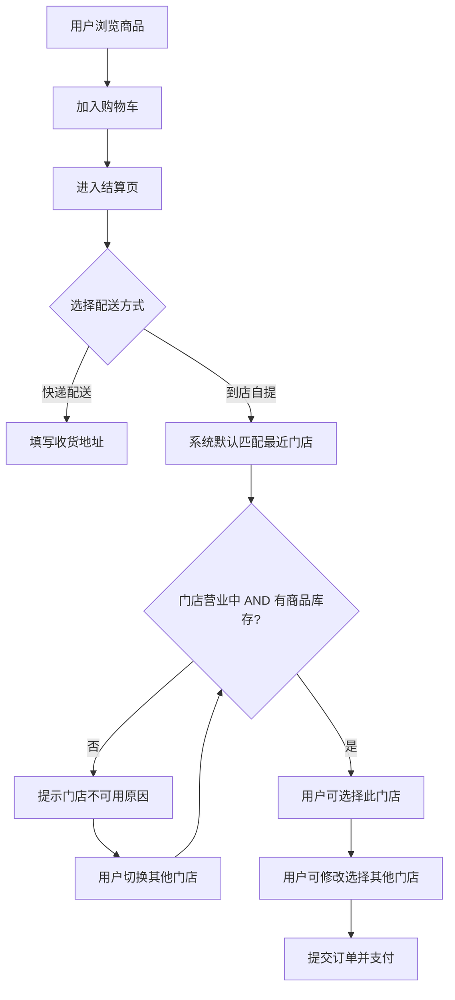
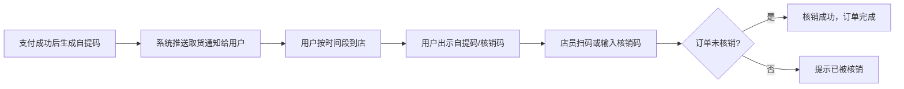
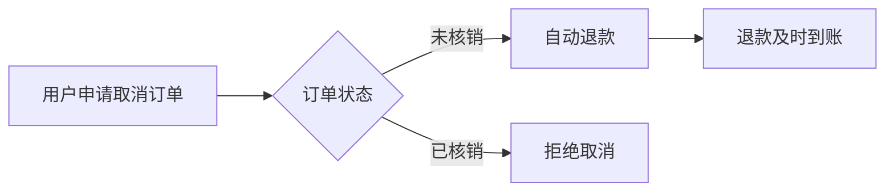
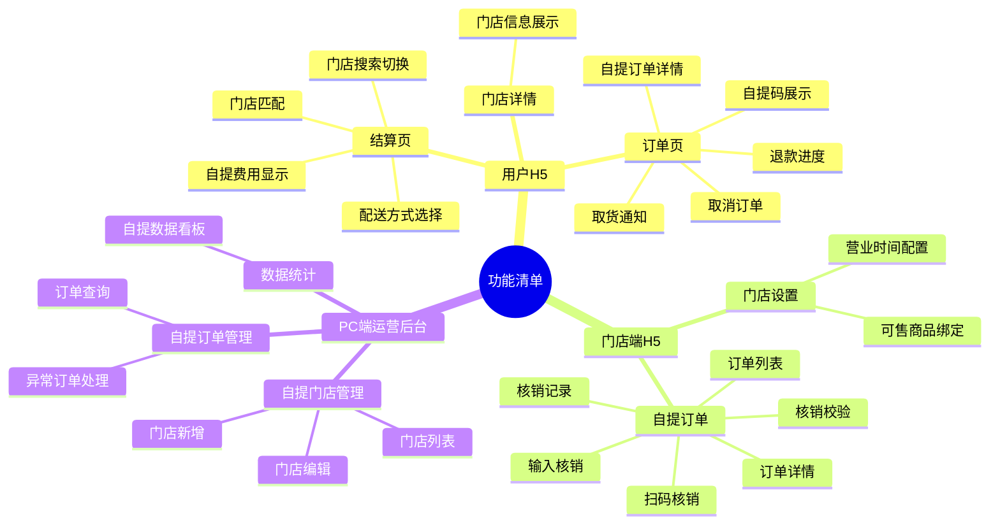

# 线上商城到店自提功能 PRD

## 一、需求背景

### 1.1 当前业务现状

现有线上商城（H5端）已支持快递配送方式，用户可在线浏览商品、下单购买、商家通过快递发货配送。

### 1.2 核心痛点

| 痛点侧 | 痛点描述 |
|--------|----------|
| 用户侧 | 快递费用增加购物成本；部分用户有到店自取的时间和地点灵活性需求 |
| 门店侧 | 线下门店缺乏有效引流手段，用户到店后可促进额外消费机会未被激活 |
| 平台侧 | 配送场景单一，订单履约成本较高，门店资源未充分利用 |

### 1.3 受影响角色

| 角色 | 说明 |
|------|------|
| C端用户 | 下单时选择自提方式，到店出示核销码取货 |
| 门店店员 | 查看自提订单、核销自提码、完成交付 |
| 商城运营管理员 | 管理自提门店配置、监控自提订单数据 |

---

## 二、需求目标

### 2.1 核心目标

为线上商城增加"到店自提"配送方式，用户可选择就近门店自提，节省快递费用；同时为线下门店引流，促进到店附加消费。

### 2.2 具体目标

| 目标编号 | 目标描述 | 可衡量标准 |
|----------|----------|------------|
| G1 | 用户下单时可选择"快递配送"或"到店自提"两种配送方式 | 用户自提订单下单支付流畅完成，自提订单量占比 > 30% |
| G2 | 用户到店出示核销码，门店扫码/输入核销码顺利完成核销 | 核销操作成功率 >= 99% |
| G3 | 支持用户在下单后、未核销前取消订单并自动退款 | 取消退款及时到账 |

---

## 三、需求核心业务流程图

### 3.1 下单页流程



### 3.2 核销取货流程



### 3.3 取消退款流程



### 3.4 门店管理流程


---

## 四、需求功能清单

### 4.1 功能架构思维导图



---

### 4.2 功能详细清单

| 序号 | 终端 | 模块 | 功能 | 描述 | 优先级 |
|------|------|------|------|------|--------|
| 1 | 用户H5 | 结算页 | 配送方式选择 | 下单时选择快递配送或到店自提 | Must |
| 2 | 用户H5 | 结算页 | 门店匹配与切换 | 根据用户地址匹配最近的自提门店，支持搜索切换 | Must |
| 3 | 用户H5 | 订单页 | 自提码展示 | 支付后展示核销码和二维码 | Must |
| 4 | 用户H5 | 订单页 | 取货通知 | 推送取货提醒消息 | Must |
| 5 | 用户H5 | 订单页 | 取消订单 | 未核销前可取消订单并自动退款 | Must |
| 6 | 门店端H5 | 自提订单 | 扫码核销 | 扫描用户自提码完成核销 | Must |
| 7 | 门店端H5 | 自提订单 | 输入核销 | 手动输入核销码完成核销 | Must |
| 8 | 门店端H5 | 自提订单 | 核销记录 | 查看历史核销记录 | Should |
| 9 | 门店端H5 | 门店设置 | 可售商品绑定 | 设置门店支持自提的商品范围 | Must |
| 10 | PC端 | 自提门店管理 | 门店新增/编辑 | 新增和编辑自提门店信息 | Must |
| 11 | PC端 | 自提门店管理 | 门店列表 | 查看和管理所有自提门店 | Must |
| 12 | PC端 | 自提订单管理 | 订单查询 | 查询和导出自提订单 | Must |
| 13 | PC端 | 自提订单管理 | 异常订单处理 | 处理超时未取货、退款纠纷等异常情况 | Must |
| 14 | PC端 | 数据统计 | 自提数据看板 | 展示自提业务核心指标 | Should |

> **后端改造说明**：后端订单服务、门店服务、消息服务、库存服务等接口改动和数据结构变更，请参见第六章"系统改造"部分。

---

## 五、需求功能详述

### 5.1 H5端——结算页——配送方式选择

**原型描述**：
结算页顶部展示配送方式选择区块，两个圆角卡片并排："快递配送"（默认选中）和"到店自提"。选中态高亮，未选中态为描边样式。

```
┌─────────────────────────────────────────────┐
│  确认订单                                   │
├─────────────────────────────────────────────┤
│  配送方式                                   │
│  ┌──���───────────────┐ ┌──────────────────┐  │
│  │ ● 快递配送       │ │ ○ 到店自提       │  │
│  │   预计3-5天送达  │ │   免运费 到店取  │  │
│  └──────────────────┘ └──────────────────┘  │
│                                             │
│  收货地址                                   │
│  ┌─────────────────────────────────────┐    │
│  │ 张三  138****0000                   │    │
│  │ 上海市浦东新区xx路xx号               │    │
│  └─────────────────────────────────────┘    │
│                                             │
│  商品清单  ···                              │
│  运费：¥5.00                               │
│  合计：¥108.00                [提交订单]   │
└─────────────────────────────────────────────┘
```

**前置条件**：
- 用户已登录
- 购物车中商品均支持配送

**用户故事**：
> 作为一个C端用户，我想要在下单时选择"到店自提"配送方式，以便于节省快递费用并灵活安排取货时间。

**核心逻辑**：
- 默认选中"快递配送"
- 选择"到店自提"后，显示门店选择区块，快递地址填写区块隐藏
- 选择"快递配送"后，显示地址填写区块，门店选择区块隐藏

**边界条件与异常处理**：
- 边界条件：购物车商品中有不支持自提的商品时，"到店自提"选项置灰不可选
- 边界条件：**购物车涉及多商城商品时，"到店自提"选项置灰不可选**（因不同商城合作门店不同，自提仅支持单商城订单）
- 异常处理：门店列表为空时，提示"当前区域暂不支持自提，请选择快递配送"

**验收标准 (Acceptance Criteria)**：
- 🎯 **成功场景**：用户点击"到店自提"，页面平滑切换展示门店选择区块，快递费用显示为0元
- ✔️ **校验场景**：
  - 购物车含不支持自提商品时，"到店自提"选项置灰，点击提示"部分商品不支持自提"
  - **购物车涉及多商城商品时，"到店自提"选项置灰，点击提示"多商城商品仅支持快递配送"
- ❌ **异常场景**：门店列表为空时切换到自提，弹窗提示"当前区域暂不支持自提"

---

### 5.2 H5端——结算页——门店匹配与切换

**原型描述**：
门店选择区块默认展示匹配到的最近门店卡片（含门店名称、距离、地址），点击"切换门店"展开门店搜索列表，支持搜索门店名称或按列表选择其他门店。不支持自提的门店（未营业或无库存）显示为不可选状态。

```
┌─────────────────────────────────────────────┐
│  自提门店                      [切换门店 >] │
│  ┌──────────────────────────────────���──┐    │
│  │ 📍 星马特浦东店           0.8km     │    │
│  │    上海市浦东新区世纪大道xx号        │    │
│  │    营业时间：09:00-22:00             │    │
│  └─────────────────────────────────────┘    │
├─────────────────────────────────────────────┤
│  [展开时] 选择门店                          │
│  ┌─────────────────────────────────────┐    │
│  │ 🔍 搜索门店名称                     │    │
│  └─────────────────────────────────────┘    │
│  ● 星马特浦东店    0.8km   营业中           │
│  ○ 星马特徐汇店    2.3km   营业中           │
│  ○ 星马特静安店    3.1km   [休息中]         │
│  ○ 星马特长宁店    4.5km   [无库存]         │
└─────────────────────────────────────────────┘
```

**前置条件**：
- 用户已选择"到店自提"配送方式

**用户故事**：
> 作为一个C端用户，我想要系统自动为我匹配最近的可用门店，并支持自由切换选择其他门店，以便于找到最便利的自提点。

**核心逻辑**：
- 进入结算页时，自动获取用户收货地址，根据经纬度计算距离最近的门店
- 门店列表按距离从近到远排序，仅展示支持自提的门店（门店营业中 AND 商品有库存）
- 用户可搜索门店名称或点击展开列表选择其他门店
- 选择门店时实时校验门店营业状态和商品库存，不满足则提示不可用原因

**边界条件与异常处理**：
- 边界条件：门店数量超过10个时分页展示
- 边界条件：门店未营业或商品无库存时显示为灰色不可选，hover或点击提示具体原因
- 异常处理：无法获取定位时，使用收货地址文本匹配

**验收标准 (Acceptance Criteria)**：
- 🎯 **成功场景**：默认展示距离最近的门店，用户可切换选择其他门店
- ✔️ **校验场景**：搜索不存在的门店名称，列表显示空状态
- ❌ **异常场景**：定位失败时使用收货地址文本匹配门店

---

### 5.3 H5端——订单页——自提码展示

**原型描述**：
自提订单详情页顶部展示自提码区域，含二维码和6位数字码，下方有"保存图片"和"复制码"按钮。核销码区域有明显的视觉标识。

```
┌─────────────────────────────────────────────┐
│  订单详情                                   │
├─────────────────────────────────────────────┤
│             ┌─────────────────┐             │
│             │ ██████████████  │             │
│             │ ██  二维码  ██  │             │
│             │ ██████████████  │             │
│             └─────────────────┘             │
│                                             │
│           取货码：1 2 3 4 5 6               │
│        有效期至：待取货时长期有效            │
│                                             │
│     [  保存图片  ]    [  复制核销码  ]      │
├─────────────────────────────────────────────┤
│  自提门店：星马特浦东店                     │
│  地址：浦东新区世纪大道xx号                 │
│  营业：09:00-22:00   📞 021-xxxx            │
└─────────────────────────────────────────────┘
```

**前置条件**：
- 订单支付成功

**用户故事**：
> 作为一个C端用户，我想要在支付成功后获取核销码和二维码，以便于到店出示给店员完成取货。

**核心逻辑**：
- 生成唯一6位数字核销码
- 同步生成二维码，内容包含核销码和订单ID
- 核销码有效期与订单状态绑定（未核销前有效）

**边界条件与异常处理**：
- 边界条件：截图保存时二维码清晰度需保证可扫描
- 异常处理：订单取消后核销码立即失效

**验收标准 (Acceptance Criteria)**：
- 🎯 **成功场景**：支付成功后正确展示核销码和二维码，支持截图保存
- ✔️ **校验场景**：订单取消后核销码立即失效，扫码提示"订单已取消"
- ❌ **异常场景**：网络异常导致码生成失败时显示重试按钮

---

### 5.4 H5端——订单页——取货通知

**原型描述**：
订单状态变更时，用户收到站内消息通知，消息内容包含门店名称、地址、核销码。通知消息点击后跳转至对应订单详情页。

```
┌─────────────────────────────────────────────┐
│  消息通知                                   │
├─────────────────────────────────────────────┤
│  ┌─────────────────────────────────────┐    │
│  │ 🛍 订单可取货提醒         10:32     │    │
│  │                                     │    │
│  │ 您的订单已可到店取货！               │    │
│  │ 取货门店：星马特浦东店               │    │
│  �� 门店地址：浦东新区世纪大道xx号       │    │
│  │ 营业时间：09:00-22:00               │    │
│  �� 取货码：123456                      │    │
│  │                                     │    │
│  │                      [查看订单 >]   │    │
│  └─────────────────────────────────────┘    │
│                                             │
│  ┌─────────────────────────────────────┐    │
│  │ ✅ 取货成功通知           昨天       │    │
│  │ 您的订单已完成取货，感谢惠顾！       │    │
│  └─────────────────────────────────────┘    │
└─────────────────────────────────────────────┘
```

**前置条件**：
- 订单支付成功，自提码已生成

**用户故事**：
> 作为一个C端用户，我想要在订单状态变更时收到及时的通知，以便于了解取货时机和核销结果。

**核心逻辑**：
- 支付成功后触发第一条通知：站内消息 + 短信，内容包含门店地址、营业时间、核销码
- 核销完成后触发第二条通知：取货成功确认通知
- 站内消息支持点击跳转至订单详情页

**边界条件与异常处理**：
- 边界条件：短信发送失败时仅保留站内消息，不阻塞主流程
- 异常处理：用户未开启通知权限时，仅发送短信，不报错

**验收标准 (Acceptance Criteria)**：
- 🎯 **成功场景**：支付成功后用户收到站内消息和短信，消息内容包含门店地址和核销码
- ✔️ **校验场景**：点击站内消息正确跳转至对应订单详情页
- ❌ **异常场景**：短信发送失败时站内消息仍正常展示，主流程不受影响

---

### 5.5 H5端——订单页——取消订单

**原型描述**：
订单详情页底部有"取消订单"按钮（仅待取货状态显示），点击后弹出确认框提示"取消后将自动退款，是否继续？"，确认后进入退款流程。

```
┌─────────────────────────────────────────────┐
│  订单详情                 状态：待取货      │
├─────────────────────────────────────────────┤
│  订单编号：2026043012345678                 │
│  下单时间：2026-04-30 10:30                 │
│  自提门店：星马特浦东店                     │
│  ···                                        │
├─────────────────────────────────────────────┤
│              [取消订单]                     │
└─────────────────────────────────────────────┘

         ┌──────────────────────────┐
         │  确认取消订单？          │
         │                          │
         │  取消后将自动退款至原    │
         │  支付渠道，预计即时到账  │
         │                          │
         │  [暂不取消]  [确认取消]  │
         └──────────────────────────┘
```

**前置条件**：
- 订单状态为"待取货"（已支付但未核销）

**用户故事**：
> 作为一个C端用户，我想要在未取货前随时取消订单并获得退款，以便于临时变化时不需要继续等待取货。

**核心逻辑**：
- 取消订单前校验订单状态，确认未核销
- 调用退款接口，实时返回退款结果
- 退款成功后订单状态变更为"已取消"
- 释放库存（如果占用）

**边界条件与异常处理**：
- 边界条件：退款到账时间为即时到账（已确认）
- 异常处理：退款接口超时，订单状态标记为"退款处理中"，后台重试

**验收标准 (Acceptance Criteria)**：
- 🎯 **成功场景**：点击取消确认后立即退款到账，订单状态变更为"已取消"
- ✔️ **校验场景**：已核销订单不显示"取消订单"按钮
- ❌ **异常场景**：退款失败时提示"退款处理中，请稍后查看"


---

### 5.6 门店端——自提订单——扫码核销

**原型描述**：
店员点击"扫码核销"按钮，调起手机相机扫描用户出示的二维码/自提码，扫描成功后将核销码回填并自动提交核销。

```
┌─────────────────────────────────────────────┐
│  自提核销                                   │
├─────────────────────────────────────────────┤
│                                             │
│         ┌───────────────────────┐           │
│         │                       │           │
│         │    [ 相机取景框 ]     │           │
│         │    将二维码对准框内   │           │
│         │                       │           │
│         └───────────────────────┘           │
│                                             │
│             扫描用户出示的自提码             │
│                                             │
│         [✗ 取消]    [💡 打开手电]           │
│                                             │
├─────────────────────────────────────────────┤
│  扫码失败？  [改为手动输入核销码]           │
└─────────────────────────────────────────────┘

  [扫描成功后弹窗]
  ┌────────────────────────────┐
  │ ✅ 核销成功                │
  │ 订单：2026043012345678     │
  │ 用户：张三                 │
  │ 商品：xx商品 x2            │
  │                [确 认]     │
  └────────────────────────────┘
```

**前置条件**：
- 店员已登录门店账号

**用户故事**：
> 作为一个门店店员，我想要通过扫描用户出示的核销码来完成取货核销，以便于快速准确地完成交付。

**核心逻辑**：
- 扫码成功后解析核销码
- 调用后端核销校验接口，校验通过后标记订单已核销
- 核销成功后向用户发送取货完成通知

**边界条件与异常处理**：
- 边界条件：扫码识别失败时提示"无法识别，请手动输入核销码"
- 异常处理：网络异常时本地暂存核销请求，待网络恢复后重试

**验收标准 (Acceptance Criteria)**：
- 🎯 **成功场景**：扫描成功自动提交核销，订单状态变更为"已核销"
- ✔️ **校验场景**：已核销码再次扫描提示"该订单已核销"
- ❌ **异常场景**：未支付订单扫码提示"该订单尚未支付"


---

### 5.7 门店端——自提订单——输入核销

**原型描述**：
门店端提供手动输入核销码的输入框和提交按钮，作为扫码失败的备用核销方式。

```
┌─────────────────────────────────────────────┐
│  手动输入核销码                             │
├─────────────────────────────────────────────┤
│                                             │
│  请输入用户的6位取货码                      │
│  ┌─────────────────────────────────────┐    │
│  │  _ _ _ _ _ _                        │    │
│  └─────────────────────────────────────┘    │
│        （输入不足6位时提交按钮不可点击）     │
│                                             │
│                   [提交核销]                │
│                                             │
│  ─────────────────────────────────────      │
│  [< 返回扫码]                               │
└─────────────────────────────────────────────┘
```

**前置条件**：
- 店员已登录门店账号

**用户故事**：
> 作为一个门店店员，我想要在扫码失败时能够手动输入核销码完成核销，以便于在扫码设备异常时仍能正常服务用户。

**核心逻辑**：
- 店员输入6位核销码后点击提交
- 调用后端核销校验接口，校验通过后标记订单已核销

**边界条件与异常处理**：
- 边界条件：输入不足6位时提交按钮不可点击
- 异常处理：核销码不存在时提示"核销码不存在"

**验收标准 (Acceptance Criteria)**：
- 🎯 **成功场景**：输入正确核销码并提交，核销成功
- ✔️ **校验场景**：输入不足6位提交按钮不可点击
- ❌ **异常场景**：输入无效核销码提示"核销码不存在"


---

### 5.8 门店端——自提订单——核销记录

**原型描述**：
门店端"核销记录"标签页，以列表形式展示历史核销明细，含核销时间、订单编号、商品名称、操作店员。支持按日期范围筛选。

```
┌─────────────────────────────────────────────┐
│  核销记录                                   │
├─────────────────────────────────────────────┤
│  日期：[2026-04-01] 至 [2026-04-30]  [筛选]│
├─────────────────────────────────────────────┤
│  ┌─────���───────────────────────────────┐    │
│  │ 2026-04-30 14:23    操作人：李四    │    │
│  │ 订单：2026043012345678              │    │
│  │ 核销码：123456                      │    │
│  │ 商品：xx商品 x2                     │    │
│  └─────────────────────────────────────┘    │
│  ┌─────────────────────────────────────┐    │
│  │ 2026-04-30 11:05    操作人：王五    │    │
│  │ 订单：2026043087654321              │    │
│  │ 核销码：654321                      │    │
│  │ 商品：xx商品 x1                     │    │
│  └─────────────────────────────────────┘    │
│  ···                                        │
└─────────────────────────────────────────────┘
```

**前置条件**：
- 店员已登录门店账号

**用户故事**：
> 作为一个门店店员，我想要查看历史核销记录，以便于追溯和核对过往的取货业务。

**核心逻辑**：
- 展示该门店所有已完成的核销记录，按核销时间倒序排列
- 每条记录展示：核销时间、订单编号、核销码、操作店员、商品清单摘要
- 支持按日期范围筛选

**边界条件与异常处理**：
- 边界条件：无历史核销记录时显示空状态提示
- 边界条件：列表超过50条时分页加载

**验收标准 (Acceptance Criteria)**：
- 🎯 **成功场景**：正确展示该门店所有历史核销记录，按时间倒序
- ✔️ **校验场景**：按日期筛选后仅展示对应时段的记录
- ❌ **异常场景**：无记录时展示空状态，不报错


---

### 5.9 门店端——门店设置——可售商品绑定

**原型描述**：
门店设置页"可售商品"标签，展示当前绑定支持自提的商品列表，提供"添加商品"和"移除"操作。未绑定时默认所有商品均支持自提。

```
┌─────────────────────────────────────────────┐
│  门店设置 > 可售商品管理                    │
├─────────────────────────────────────────────┤
│  ℹ 未添加时默认全部商品支持自提             │
│                                   [添加商品]│
├──────────────┬─────────────┬───────────────┤
│  商品名称    │  商品编号   │  操作         │
├─────────���────┼─────────────┼───────────────┤
│  xx商品A     │  SKU-001    │  [移除]       │
├──────────────┼─────────────┼───────────────┤
│  xx商品B     │  SKU-002    │  [移除]       │
├──────────────┼─────────────┼───────────────┤
│  xx商品C     │  SKU-003    │  [移除]       │
└──────────────┴─────────────┴───────────────┘
```

**前置条件**：
- 店员已登录门店账号，且有门店设置权限

**用户故事**：
> 作为一个门店店员，我想要设置哪些商品支持到店自提，以便于控制门店的自提服务范围。

**核心逻辑**：
- 默认状态（未绑定任何商品）：门店所有商品支持自提
- 绑定指定商品后：仅绑定的商品支持自提，其他商品在结算页自提选项中不可选
- 支持从商城商品库中搜索添加商品，支持批量移除

**边界条件与异常处理**：
- 边界条件：绑定商品列表为空时，系统视为"全部商品支持自提"
- 异常处理：添加已下架商品时提示"该商品已下架，无法添加"

**验收标准 (Acceptance Criteria)**：
- 🎯 **成功场景**：绑定指定商品后，C端结算页仅该商品支持自提选项
- ✔️ **校验场景**：添加已下架商品时提示错误
- ❌ **异常场景**：保存失败时提示错误原因，数据不更新


---

### 5.10 PC端——自提门店管理——门店新增/编辑

**原型描述**：
门店管理列表页右上角"新增门店"按钮，点击进入新增表单页，填写门店名称、地址、经纬度、联系方式、营业时间，点击保存后门店生效。

```
┌─────────────────────────────────────────────────────────┐
│  新增自提门店                              [x 关闭]     │
├─────────────────────────────────────────────────────────┤
│  门店名称：[_______________________________]  *必填     │
│                                                         │
│  门店地址：[_______________________________]  *必填     │
│                                                         │
│  经度：[_______________]  纬度：[_______________]  *必填│
│              （可从地图工具获取坐标）                   │
│                                                         │
│  联系电话：[_______________________________]  *必填     │
│                                                         │
│  营业时间：                                             │
│  ┌──────┬──────────────────────────┬─────────────────┐ │
│  │ 周一 │ ● 营业  09:00 - 22:00    │ ○ 休息          │ │
│  │ 周二 │ ● 营业  09:00 - 22:00    │ ○ 休息          │ │
│  │ ···  │ ···                      │ ···             │ │
│  └──────┴──────────────────────────┴─────────────────┘ │
│                                                         │
│                    [取 消]      [保存门店]              │
└─────────────────────────────────────────────────────────┘
```

**前置条件**：
- 管理员已登录PC端后台

**用户故事**：
> 作为一个平台运营管理员，我想要新增和编辑自提门店信息，以便于管理可提供自提服务的线下门店。

**核心逻辑**：
- 新增门店时需要填写完整信息，含经纬度坐标（用于距离计算）
- 营业时间按周一至周日分别设置，每个时段设置开始和结束时间
- 保存前校验必填项和地址坐标有效性

**边界条件与异常处理**：
- 边界条件：经纬度需要在合理范围内（中国大陆地区）
- 异常处理：保存失败时保留表单数据，提示错误原因

**验收标准 (Acceptance Criteria)**：
- 🎯 **成功场景**：填写完整信息后保存成功，门店出现在门店列表
- ✔️ **校验场景**：必填项为空时保存按钮不可点击
- ❌ **异常场景**：经纬度超范围时提示"坐标超出服务区域"


---

### 5.11 PC端——自提门店管理——门店列表

**原型描述**：
门店管理列表页，表格展示所有自提门店，列含门店名称、地址、营业时间、状态（启用/禁用）、操作（编辑/禁用）。顶部支持按名称、状态、区域筛选，右上角有"新增门店"入口。

```
┌──────────────────────────────────────────────────────────────────────┐
│  自提门店管理                                      [+ 新增门店]      │
├──────────────────────────────────────────────────────────────────────┤
│  门店名称 [__________]  状态 [全部 ▼]  区域 [全部 ▼]  [搜索][重置] │
├─────────┬──────────────────┬──────────────┬──────┬──────────────────┤
│ 门店名称 │ 地址             │ 营业时间     │ 状态 │ 操作             │
├─────────┼──────────────────┼──────────────┼──────┼──────────────────┤
│ 浦东店  │ 浦东新区世纪大道 │ 09:00-22:00  │ 启用 │ [编辑] [禁用]    │
├─────────┼──────────────────┼──────────────┼──────┼──────────────────┤
│ 徐汇店  │ 徐汇区漕溪北路   │ 10:00-21:00  │ 启用 │ [编辑] [禁用]    │
├─────────┼──────────────────┼──────────────┼──────┼──────────────────┤
│ 静安店  │ 静安区南京西路   │ 09:00-22:00  │ 禁用 │ [编辑] [启用]    │
└─────────┴──────────────────┴──────────────┴──────┴──────────────────┘
  共 12 条    < 1  2  3 >                               [导出列表]
```

**前置条件**：
- 管理员已登录PC端后台

**用户故事**：
> 作为一个平台运营管理员，我想要查看和管理所有自提门店，以便于监控门店状态并及时处理异常。

**核心逻辑**：
- 列表展示所有门店，支持按名称关键词搜索、按状态（启用/禁用）和区域筛选
- 点击"禁用"后门店立即对C端不可见，已选该门店的待付款订单不受影响
- 支持批量导出门店列表

**边界条件与异常处理**：
- 边界条件：无门店时显示空状态引导新增
- 边界条件：禁用有待核销订单的门店时，弹窗提示"该门店有待核销订单，禁用后用户仍可完成取货，确认禁用？"

**验收标准 (Acceptance Criteria)**：
- 🎯 **成功场景**：列表正确展示所有门店信息，筛选条件有效
- ✔️ **校验场景**：禁用有待核销订单的门店时弹出确认提示
- ❌ **异常场景**：加载失败时提示错误，支持重试


---

### 5.12 PC端——自提订单管理——订单查询

**原型描述**：
自提订单管理列表页，表格展示所有自提订单，列含订单编号、用户信息、门店名称、商品名称、金额、状态、核销时间。支持按门店、订单状态、核销码、时间范围多维度筛选。

```
┌────────────────────────────────────────────────────────────────────────┐
│  自提订单管理                                              [导出Excel] │
├────────────────────────────────────────────────────────────────────────┤
│  门店 [全部 ▼]  状态 [全部 ▼]  核销码 [______]                        │
│  下单时间 [2026-04-01] 至 [2026-04-30]        [搜索] [重置]           │
├──────────────┬───────┬──────┬────────┬────────┬───────┬──────────────┤
│ 订单编号     │ 用户  │ 门店 │ 商品   │ 金额   │ 状态  │ 核销时间     │
├──────────────┼───────┼──────┼────────┼────────┼───────┼──────────────┤
│ 202604301234 │ 张三  │ 浦东 │ xx商品 │ ¥99.0  │ 已核销│ 04-30 14:23  │
├──────────────┼───────┼──────┼────────┼────────┼───────┼──────────────┤
│ 202604298765 │ 李四  │ 徐汇 │ xx商品 │ ¥199.0 │ 待取货│ —            │
├──────────────┼───────┼──────┼────────┼────────┼───────┼──────────────┤
│ 202604284321 │ 王五  │ 浦东 │ xx商品 │ ¥59.0  │ 已取消│ —            │
└──────────────┴───────┴──────┴────────┴────────┴───────┴──────────────┘
  共 156 条   < 1  2  3 ···  8 >
```

**前置条件**：
- 管理员已登录PC端后台

**用户故事**：
> 作为一个平台运营管理员，我想要查询和导出所有自提订单，以便于进行订单数据分析和问题追溯。

**核心逻辑**：
- 展示全部自提订单，支持按门店、状态（待取货/已核销/已取消/已过期）、核销码、下单时间筛选
- 支持导出订单数据为 Excel
- 点击订单编号可查看订单详情

**边界条件与异常处理**：
- 边界条件：数据量大时支持分页，每页默认20条
- 边界条件：核销码精确匹配，不支持模糊搜索

**验收标准 (Acceptance Criteria)**：
- 🎯 **成功场景**：列表正确展示自提订单，多维度筛选生效
- ✔️ **校验场景**：按核销码搜索精确匹配对应订单
- ❌ **异常场景**：导出失败时提示错误，不影响列表展示


---

### 5.13 PC端——自提订单管理——异常订单处理

**原型描述**：
异常订单列表页，展示超时未取货、退款纠纷等异常状态订单，每条记录可展开查看异常原因，提供"手动退款"、"标记已处理"操作入口。

```
┌──────────────────────────────────────────────────────────────────────┐
│  异常订单处理                                                        │
├──────────────────────────────────────────────────────────────────────┤
│  异常类型 [全部 ▼]  门店 [全部 ▼]  状态 [待处理 ▼]  [搜索][重置]  │
├────────────────┬──────┬──────┬────────────────┬──────┬──────────────┤
│ 订单编号       │ 用户 │ 门店 │ 异常原因       │ 状态 │ 操作         │
├────────────────┼──────┼──────┼────────────────┼──────┼──────────────┤
│ 2026042812345  │ 张三 │ 浦东 │ 超时未取货     │待处理│[退款][已处理]│
├────────────────┼──────┼──────┼────────────────┼──────┼──────────────┤
│ 2026042798765  │ 李四 │ 徐汇 │ 退款处理中超时 │待处理│[退款][已处理]│
└────────────────┴──────┴──────┴────────────────┴──────┴──────────────┘

  [手动退款确认弹窗]
  ┌──────────────────────────────┐
  │  确认手动退款？              │
  │  订单：2026042812345         │
  │  退款金额：¥99.00            │
  │  处理备注：[______________]  │
  │  [取 消]      [确认退款]     │
  └──────────────────────────────┘
```

**前置条件**：
- 管理员已登录PC端后台，且有异常订单处理权限

**用户故事**：
> 作为一个平台运营管理员，我想要处理异常订单（超时未取货、退款纠纷等），以便于保障用户体验和解决退款问题。

**核心逻辑**：
- 异常订单来源：超时未取货自动标记、用户投诉触发、退款处理中超时
- 运营可手动触发退款（需二次确认），退款成功后订单状态变更为已取消
- 处理后需填写处理备注，留存操作记录

**边界条件与异常处理**：
- 边界条件：手动退款需有退款权限的角色才可操作
- 异常处理：手动退款失败时提示失败原因，可重试

**验收标准 (Acceptance Criteria)**：
- 🎯 **成功场景**：手动退款成功，订单状态变更，用户收到退款
- ✔️ **校验场景**：无退款权限的账号不显示手动退款按钮
- ❌ **异常场景**：手动退款失败时提示原因，状态保持不变


---

### 5.14 PC端——数据统计——自提数据看板

**原型描述**：
数据看板页，顶部展示核心指标卡（自提订单量、核销率、自提占比、门店覆盖数），下方含折线图（自提订单趋势）和柱状图（各门店核销量对比）。支持按时间维度（今日/近7天/近30天）切换。

```
┌──────────────────────────────────────────────────────────────────┐
│  自提数据看板        [今日] [近7天] [近30天]                     │
├────────────┬──────────────┬──────────────┬───────────────────────┤
│ 自提订单量 │  核销率      │  自提占比    │  覆盖门店数           │
│   1,256    │   94.3%      │   32.1%      │      12               │
│  ↑12% ▲   │  ↑0.8% ▲    │  ↑3.2% ▲    │  较上期 +2            │
├────────────┴──────────────┴──────────────┴───────────────────────┤
│  自提订单趋势                                                    │
│  ↑                                                               │
│  │    ╭─╮                                                        │
│  │   ╭╯ ╰╮         ╭─╮                                          │
│  │  ╭╯   ╰─────────╯ ╰╮                                         │
│  └──────────────────────────→ 日期                               │
├──────────────────────────────────────────────────────────────────┤
│  各门店核销量对比                                                │
│  浦东店  ██████████████████  456                                 │
│  徐汇店  ████████████        312                                 │
│  静安店  ████████            198                                 │
│  长宁店  ████                98                                  │
└──────────────────────────────────────────────────────────────────┘
```

**前置条件**：
- 管理员已登录PC端后台

**用户故事**：
> 作为一个平台运营管理员，我想要查看自提业务的核心数据看板，以便于了解自提订单趋势和门店运营状况。

**核心逻辑**：
- 核心指标：自提订单量、核销率（已核销/待取货+已核销）、自提占比（自提订单/总订单）、覆盖门店数
- 趋势图：按选择时间段展示每日自提订单量折线图
- 门店对比：展示各门店的核销订单数柱状图，按量降序排列

**边界条件与异常处理**：
- 边界条件：数据为0时图表展示空状态而非报错
- 异常处理：数据加载失败时展示上次缓存数据并提示更新失败

**验收标准 (Acceptance Criteria)**：
- 🎯 **成功场景**：指标卡数据准确，图表按时间段正确展示
- ✔️ **校验场景**：切换时间维度后数据正确刷新
- ❌ **异常场景**：数据加载失败时不白屏，展示降级提示

**测试用例**（MECE原则）：
- 核心指标数值与订单数据一致
- 切换时间维度后图表正确刷新
- 数据为0时图表展示空状态
- 门店对比图按核销量降��排列

---


## 六、系统改造

### 6.1 后端接口改造

| 接口名称 | 改造类型 | 说明 |
|----------|----------|------|
| POST /api/order/create | 修改 | 新增配送方式参数，区分快递/自提，接收自提门店ID |
| GET /api/order/detail | 修改 | 返回配送方式和自提相关信息（门店地址、营业时间、核销码） |
| POST /api/order/cancel | 修改 | 新增自提订单取消退款逻辑 |
| GET /api/store/list | 修改 | 新增按距离排序和搜索过滤能力 |
| POST /api/order/verify | 新增 | 核销接口，接收核销码，校验并完成核销 |
| POST /api/refund/callback | 新增 | 退款回调接口，支持退款状态推送通知 |

### 6.2 数据结构改造

#### 6.3.1 数据库表变更

| 表名 | 改造类型 | 说明 |
|------|----------|------|
| store_pickup | 新增 | 自提门店表，存储门店地址、联系方式、经纬度、营业时间 |
| orders | 修改 | 新增配送方式字段（delivery_type）、自提门店ID字段 |
| order_items | 修改 | 新增支持自提标记（若混合订单需支持单品维度） |
| verify_log | 新增 | 核销记录表，记录核销码、订单ID、门店ID、核销时间、操作店员ID |

#### 6.3.2 数据字典

| 字段名 | 类型 | 说明 |
|--------|------|------|
| delivery_type | varchar(16) | 配送方式：express=快递，pickup=自提 |
| pickup_store_id | bigint | 自提门店ID，外键关联store_pickup |
| verify_code | varchar(8) | 6位核销码 |
| verify_status | varchar(16) | 核销状态：pending=待核销，verified=已核销，cancelled=已取消 |
| store_pickup.status | tinyint | 门店状态：0=禁用，1=启用 |

### 6.3 消息队列/定时任务（如有）

| 任务名称 | 类型 | 说明 |
|----------|------|------|
| 订单支付通知 | 消息队列 | 订单支付成功后触发，发送取货提醒通知 |
| 核销完成通知 | 消息队列 | 核销成功后触发，发送取货成功确认通知 |
| 超时未取检查 | 定时任务 | 定时扫描超时未取订单，执行自动取消和退款 |

### 6.4 非功能性需求（如有）

| 需求类型 | 要求 |
|----------|------|
| 性能 | 自提码生成接口响应时间 < 200ms；门店列表查询 < 500ms |
| 安全 | 核销接口需验证门店店员身份；退款接口需幂等处理 |
| 监控 | 核销成功率、订单取消率、退款失败率告警 |

---

## 七、测试用例

### 7.1 配送方式模块

| 用例编号 | 用例名称 | 前置条件 | 测试步骤 | 预期结果 |
|----------|----------|----------|----------|----------|
| TC-001 | 选择快递配送 | 用户已登录，购物车有商品 | 1. 进入结算页 2. 选择快递配送 | 显示收货地址填写区块，快递费用正常计算 |
| TC-002 | 选择到店自提 | 用户已登录，购物车有商品 | 1. 进入结算页 2. 选择到店自提 | 显示门店选择区块，快递费显示0元 |
| TC-003 | 切换配送方式 | 用户已登录，购物车有商品 | 1. 选择到店自提 2. 切换为快递配送 | 页面区块正确切换，费用正确更新 |
| TC-004 | 购物车多商城商品 | 用户已登录，购物车有多商城商品 | 1. 进入结算页 | 到店自提选项置灰，不可点击 |

### 7.2 门店匹配模块

| 用例编号 | 用例名称 | 前置条件 | 测试步骤 | 预期结果 |
|----------|----------|----------|----------|----------|
| TC-005 | 默认展示最近门店 | 用户已选择到店自提 | 1. 进入结算页门店选择区块 | 按距离排序正确，默认展示最近门店 |
| TC-006 | 搜索切换门店 | 用户已选择到店自提 | 1. 点击切换门店 2. 搜索门店名称 | 搜索结果正确，可切换 |

### 7.3 自提码模块

| 用例编号 | 用例名称 | 前置条件 | 测试步骤 | 预期结果 |
|----------|----------|----------|----------|----------|
| TC-007 | 支付成功生成核销码 | 订单已支付 | 1. 完成支付 | 生成6位码和二维码 |
| TC-008 | 截图保存 | 订单已支付 | 1. 点击保存图片 | 图片清晰可扫描 |
| TC-009 | 订单取消后失效 | 订单已支付后取消 | 1. 取消订单 2. 尝试扫码 | 再次扫码提示已取消 |

### 7.4 核销模块

| 用例编号 | 用例名称 | 前置条件 | 测试步骤 | 预期结果 |
|----------|----------|----------|----------|----------|
| TC-010 | 扫码核销成功 | 店员已登录 | 1. 点击扫码 2. 扫描正确码 | 核销成功，订单完成 |
| TC-011 | 扫描已核销码 | 店员已登录 | 1. 扫描已核销码 | 提示已核销，无法重复 |
| TC-012 | 扫描未支付订单码 | 店员已登录 | 1. 扫描未支付订单码 | 提示请先支付 |
| TC-013 | 输入正确码核销 | 店员已登录 | 1. 手动输入正确核销码 2. 提交 | 核销成功 |
| TC-014 | 输入无效码 | 店员已登录 | 1. 输入无效核销码 2. 提交 | 提示核销码不存在 |

### 7.5 取消退款模块

| 用例编号 | 用例名称 | 前置条件 | 测试步骤 | 预期结果 |
|----------|----------|----------|----------|----------|
| TC-015 | 待取货状态取消 | 订单待取货 | 1. 点击取消订单 2. 确认 | 立即退款，状态变已取消 |
| TC-016 | 已核销状态取消 | 订单已核销 | 1. 进入订单详情页 | 按钮不显示，无法取消 |
| TC-017 | 查看退款状态 | 已申请取消 | 1. 进入退款详情页 | 显示处理中/已到账 |

### 7.6 门店管理模块

| 用例编号 | 用例名称 | 前置条件 | 测试步骤 | 预期结果 |
|----------|----------|----------|----------|----------|
| TC-018 | 新增门店 | 管理员已登录 | 1. 点击新增门店 2. 填写完整信息 3. 保存 | 保存成功，列表显示 |
| TC-019 | 编辑门店 | 管理员已登录 | 1. 点击编辑 2. 修改营业时间 3. 保存 | 保存成功，时间更新 |

---

## 八、埋点需求

### 8.1 页面事件

| 事件 ID | 事件名称 | 触发时机 | 上报参数 |
|---------|----------|----------|----------|
| PAGE_ORDER_DETAIL | 订单详情页曝光 | 进入订单详情页 | order_id, order_status, delivery_type |
| PAGE_STORE_LIST | 门店列表页曝光 | 进入门店列表页 | store_count, user_location |

### 8.2 点击事件

| 事件 ID | 事件名称 | 触发时机 | 上报参数 |
|---------|----------|----------|----------|
| CLICK_DELIVERY_SWITCH | 配送方式切换 | 用户切换配送方式 | from_type, to_type, store_id, timestamp |
| CLICK_STORE_SELECT | 门店选择 | 用户选择/切换门店 | store_id, store_name, distance, timestamp |
| CLICK_VERIFY_SCAN | 扫码核销点击 | 店员点击扫码按钮 | store_id, timestamp |
| CLICK_CANCEL_ORDER | 取消订单点击 | 用户点击取消订单 | order_id, order_status, timestamp |

### 8.3 业务事件

| 事件 ID | 事件名称 | 触发时机 | 上报参数 |
|---------|----------|----------|----------|
| EVENT_ORDER_CREATED | 自提订单创建 | 订单提交成功 | order_id, store_id, goods_count, total_amount |
| EVENT_PICKUP_NOTIFY_SEND | 取货通知发送 | 通知发送成功 | order_id, notify_type, send_status |
| EVENT_ORDER_VERIFIED | 订单核销完成 | 核销成功 | order_id, store_id, verify_type, timestamp |
| EVENT_ORDER_CANCELLED | 订单取消 | 取消成功 | order_id, cancel_reason, refund_amount |
