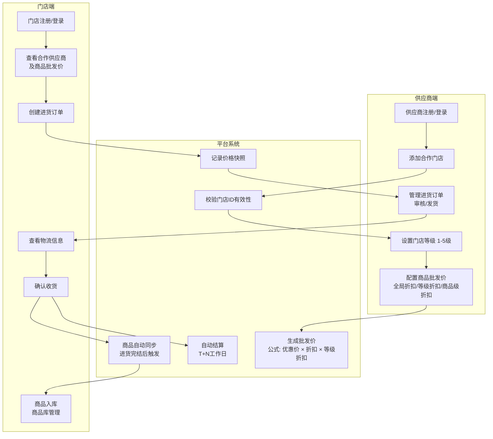
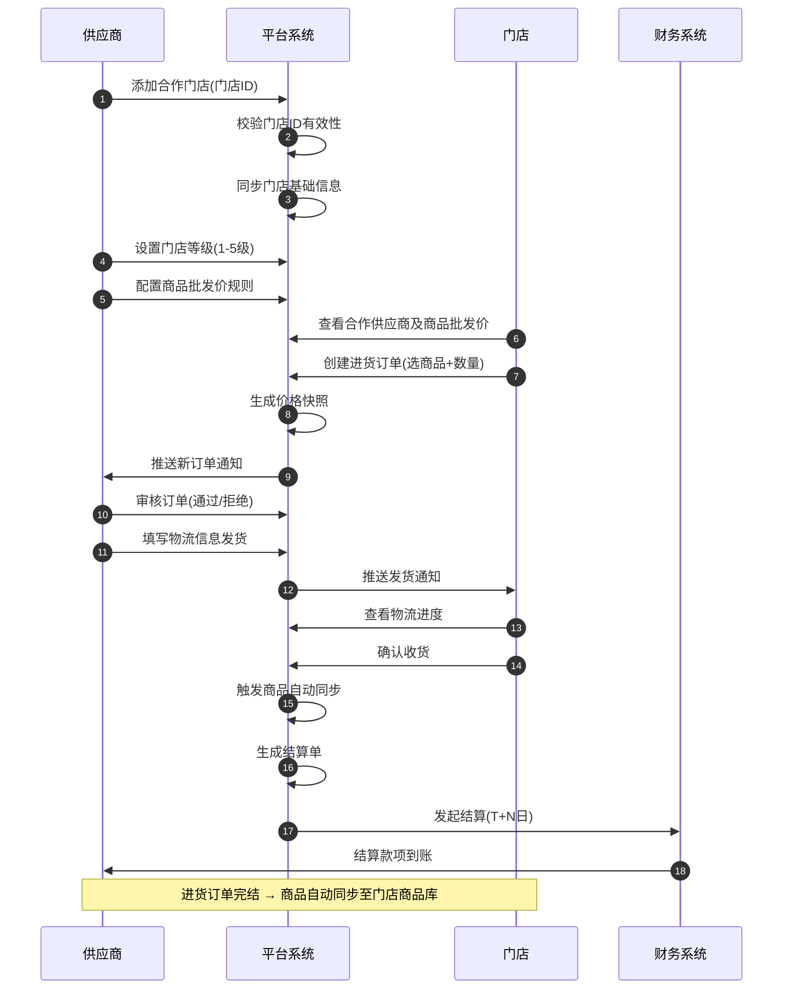
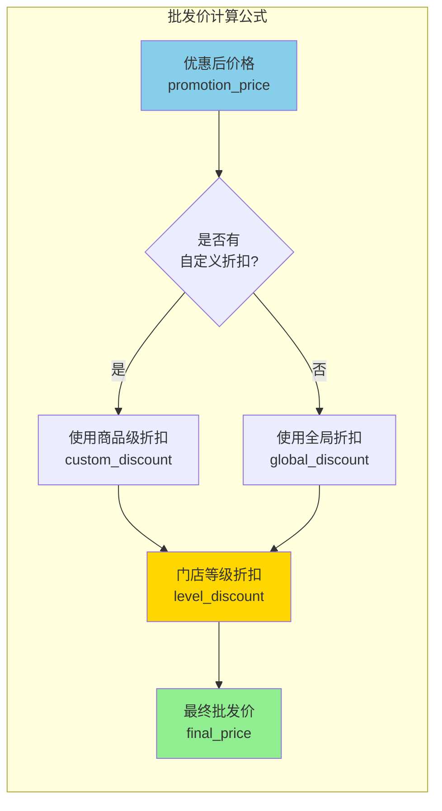
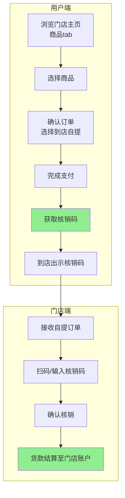
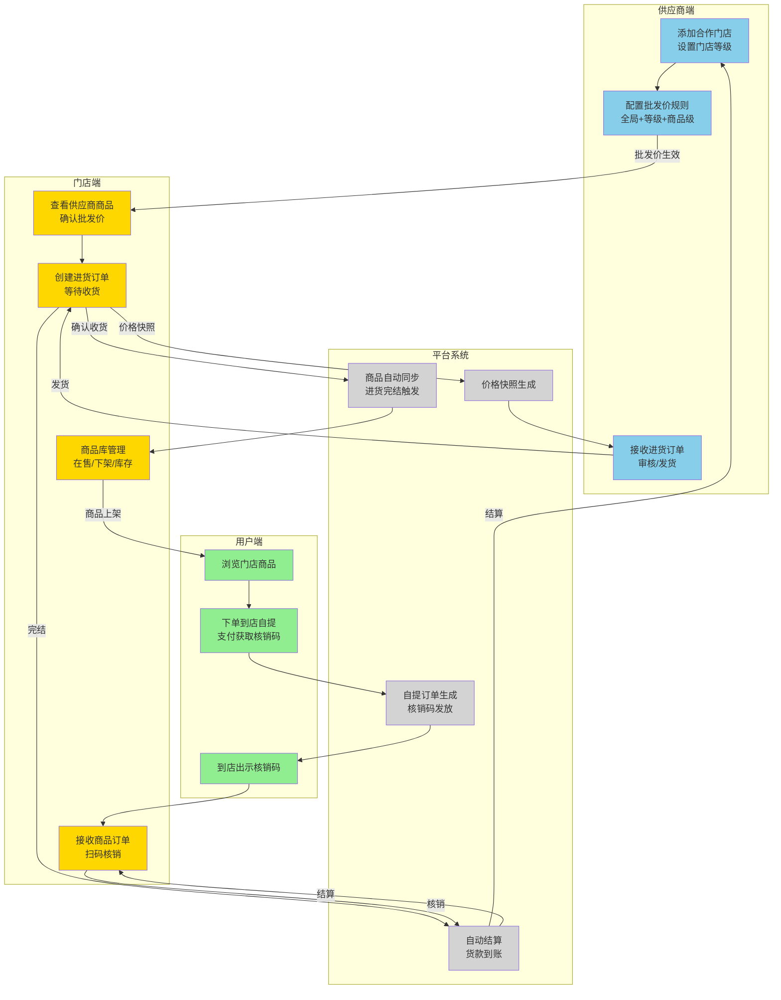

# 星马特平台 - 批发进货体系 业务流程图

## 一、供应商端 → 门店端 批发进货主流程



---

## 二、详细业务流程时序图



---

## 三、商品批发价计算逻辑



**计算公式**：
```
最终批发价 = 优惠后价格 × (自定义折扣 OR 全局折扣) × 门店等级折扣
```

---

## 四、用户端到店自提流程



---

## 五、完整业务闭环图



