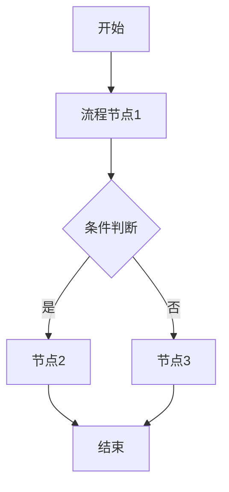
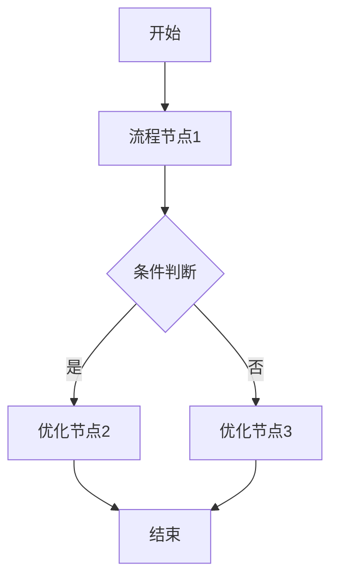

# 需求分析：{需求名称}

## 文档信息

| 字段 | 内容 |
|------|------|
| 需求名称 | {需求名称} |
| 文档版本 | V1.0 |
| 创建日期 | {YYYY-MM-DD} |
| 最后更新 | {YYYY-MM-DD} |
| 撰写人 | {撰写人} |
| 文档状态 | 草稿 / 评审中 / 已确认 |
| 关联沟通记录 | [{需求名称}-需求沟通记录-{YYYYMMDD}.md](../01_discussions/{需求名称}-需求沟通记录-{YYYYMMDD}.md) |

---

## 一、需求背景分析

### 1.1 当前业务现状

描述当前的业务情况和已存在的功能。

### 1.2 业务痛点

当前业务存在的主要问题或局限性。

### 1.3 业务机会

通过本次需求可以带来的业务改善和价值。

### 1.4 受影响的用户/角色

| 角色 | 影响说明 |
|------|----------|
| 角色1 | 影响说明 |
| 角色2 | 影响说明 |

### 1.5 不做此需求的影响

描述不做这个需求会产生的问题。

---

## 二、需求目标确认

### 2.1 核心目标

一句话描述本次需求的核心目标。

### 2.2 期望成果

**按角色/终端组织**，描述每个角色/端能实现什么：

1. **平台端**：平台管理员能做什么
2. **供应商端**：供应商能做什么
3. **门店端**：门店能做什么
4. **用户端**：用户能做什么

### 2.3 可衡量指标

- 指标1：具体可衡量的目标
- 指标2：具体可衡量的目标

---

## 三、业务流程分析

使用 Mermaid 语法绘制当前业务流程（现状）和目标流程（改善后）。

### 3.1 当前流程（现状）



### 3.2 目标流程（改善后）



### 3.3 流程对比说明（可选）

如涉及新旧流程差异，可用表格对比说明。

---

## 四、功能拆解清单

### 4.1 平台管理端功能

**菜单位置**：`菜单位置`（新增/扩展）

| 功能 | 功能描述 | 优先级 |
|------|----------|--------|
| 功能1 | 描述这个功能包含的具体内容（筛选、查看、操作等） | Must |
| 功能2 | 描述这个功能包含的具体内容 | Should |

### 4.2 供应商端功能（示例）

**菜单位置**：`新增"XX管理"菜单`

| 功能 | 功能描述 | 优先级 |
|------|----------|--------|
| XX列表 | 展示XX信息，支持筛选查询；支持添加/编辑/启用/禁用等操作 | Must |

### 4.3 门店端功能

类似结构...

### 4.4 用户端功能

类似结构...

### 4.5 功能清单（导出格式）

用于导出到 XMind 等思维导图软件：

```
- 功能清单
  - 平台管理端
    - 功能1
    - 功能2
  - 供应商端
    - XX列表
  - 门店端
    - XX列表
  - 用户端
    - XX功能
```

**编写原则**：
- 按角色/终端组织，同一角色的功能聚合在一起
- 一个列表页面包含多个操作时，合并为一个功能描述
- 功能描述应包含该功能的主要操作和业务含义

---

## 五、待确认事项

列出需求中尚未确认、需要与干系人进一步沟通的内容。

| 序号 | 待确认事项 | 状态 | 结论/说明 |
|------|------------|------|--------|
| 1 | 具体规则内容 | 待确认 | - |
| 2 | 已有结论的事项 | ✅ 已确认 | 结论说明 |

**确认原则**：
- 所有 Must 级别功能必须在 PRD 撰写前完成确认
- 未确认事项不得在 PRD 中编造，必须标注"待确认"

---

## 六、业务规则设计

如有差异化业务规则，在此说明（如分红规则、认购规则、业绩统计维度等）。

### 6.1 规则类型1

| 类型 | 规则说明 |
|------|----------|
| 类型A | 规则描述 |
| 类型B | 规则描述 |

### 6.2 规则类型2

...

---

## 七、下一步行动（可选）

1. 确认待确认事项
2. 撰写 PRD 文档
3. 原型设计
4. 技术评审