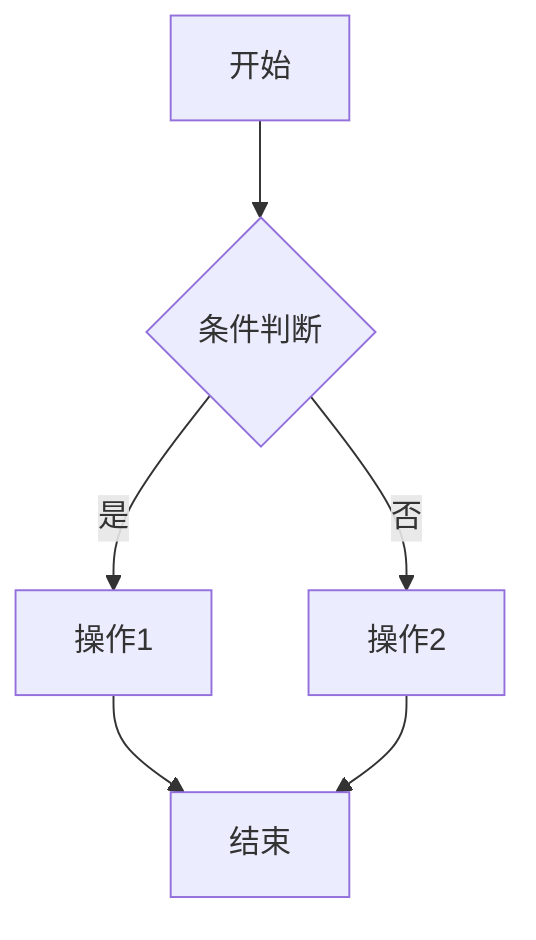
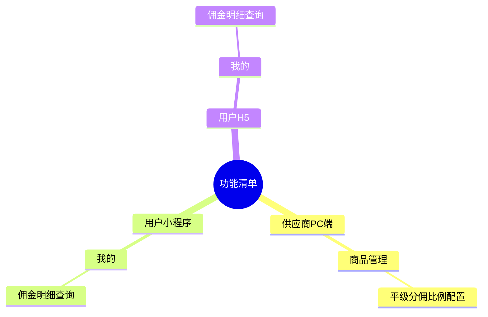

# PRD 模板

## 一、需求背景

描述当前面临的问题或机会。如果需求背景不清晰，主动询问用户。

---

## 二、需求目标

基于需求背景，写出本次项目的核心目标。

---

## 三、需求核心业务流程图

使用 Mermaid 语法绘制完整的业务流程图。



---

## 四、需求功能清单

### 4.1 功能架构思维导图

使用 Mermaid mindmap 语法，按**终端-模块-功能**三层结构展示整体功能清单，便于快速把握需求全貌：



> **提示**：如需导出到 XMind 等思维导图软件，可使用下方 Markdown 格式，复制后直接粘贴导入。

```markdown
- 功能清单
  - 供应商PC端
    - 商品管理
      - 平级分佣比例配置
  - 用户小程序
    - 我的
      - 佣金明细查询
  - 用户H5
    - 我的
      - 佣金明细查询
```

**思维导图结构说明**：
- **第一层（根节点）**：统一为"功能清单"
- **第二层**：按终端拆分，原则是"不同的用户角色 × 不同的使用设备 = 不同的终端"
- **第三层**：每个终端下的功能模块
- **第四层**：具体功能点（如有需要可继续展开）

---

### 4.2 功能详细清单

> **说明**：本表格为需求概览，描述只写核心价值（一句话），具体交互细节在第五章功能详述中展开。4.2中的每个功能对应第五章的一个 5.x 章节。

| 序号 | 终端 | 模块 | 功能 | 描述 | 优先级 |
|------|------|------|------|------|--------|
| 1 | 慧帮手APP | 首页 | banner轮播 | 展示促销活动 Banner | Must |
| 2 | 慧帮手APP | 我的 | 订单查询 | 查询订单列表 | Should |

> **后端改造说明**：后端接口改动、数据库改造、数据字典等实现细节，请参见第六章"系统改造"部分。

**表格字段说明**：

| 字段 | 填写规则 |
|------|----------|
| 序号 | 功能编号，从1开始递增，与第五章 5.x 一一对应 |
| 终端 | 从用户视角划分的使用入口名称（如：供应商PC端、用户小程序、用户H5、平台管理后台）。**区分原则**：不同的用户角色 × 不同的使用设备 = 不同的终端 |
| 模块 | 所属功能模块，与思维导图第二层对应 |
| 功能 | 前端按功能/页面/弹窗拆分，粒度与第五章 5.x 对应 |
| 描述 | 一句话概括核心价值，不展开交互细节 |
| 优先级 | Must（必须有）/ Should（应该有）/ Could（可以有）/ Won't（不会有） |

---

## 五、需求功能详述

与第四部分需求功能清单保持一致，**仅描述前端功能**（后端服务在第六章系统改造中描述）。按模块分组，每个功能单独详细描述。

**序号标注规则**：
- 序号与4.2功能详细清单一一对应，如功能清单中序号为1的功能，这里为 5.1
- 功能模块下有多个功能时，用 5.1、5.2、5.3 依次编号
- 单个功能下有多个子功能/步骤时，用 5.1.1、5.1.2 编号

**每个功能的详细描述格式**（标题带序号，如 5.1、5.1.1）：

---

#### 5.x 终端——模块——功能名称

**原型描述**：
有原型则写一段简洁的页面布局描述，并紧跟一个 ASCII 线框图（用代码块包裹），示意页面结构和关键元素，风格示例如下：

```
┌─────────────────────────────────────────┐
│  页面标题                      [x 关闭] │
├─────────────────────────────────────────┤
│  字段A：[___________________________]   │
│          （输入提示文字）               │
│                                         │
│  ┌─────────────────────────────────┐    │
│  │ ℹ 自动同步信息区块              │    │
│  │   名称：xx    地址：xx          │    │
│  └─────────────────────────────────┘    │
│                                         │
│  字段B：[下拉选项 ▼]                    │
│  备注：  [___________________________]  │
│                                         │
│  [取 消]              [确认提交]        │
└─────────────────────────────────────────┘
```

**用户故事**：
> 作为一个 [角色]，我想要 [操作]，以便于 [价值]。

**前置条件**：
- 用户需满足的状态或权限

**核心逻辑**：
- 计算规则、权限控制、数据流向

**边界条件与异常处理**：
- 边界条件：输入极限值、空值
- 异常处理：网络异常、数据冲突等处理方案

**验收标准 (Acceptance Criteria)**：
- 🎯 **成功场景**：输入 X，产出 Y
- ✔️ **校验场景**：输入错误格式，系统如何拦截
- ❌ **异常场景**：网络异常/超时，系统如何处理

---

**原型描述编写规范**：
- 描述页面布局和关键元素
- 说明交互方式和状态
- 标注重要样式（颜色、位置）
- 示例："商品列表页顶部固定搜索栏，下方2列网格展示商品卡片，卡片含图片、名称、价格"

**注意**：
- **不在后端服务功能**：纯后端接口（如数据校验、库存管理、消息推送等）不在本章描述，其接口规格和实现细节在第六章系统改造中描述。
- **功能描述中不写测试用例**：测试用例统一在第七章测试用例中编写。

---

## 六、系统改造

本章节用于描述后端改造内容，包括接口改动、数据结构变更、消息队列设计等技术实现细节。

### 6.1 后端接口改造

| 接口名称 | 改造类型 | 说明 |
|----------|----------|------|
| POST /api/xxx | 新增 | 描述接口用途和入参 |
| GET /api/xxx | 修改 | 描述改动点和影响范围 |

### 6.2 数据结构改造

#### 6.2.1 数据库表变更

| 表名 | 改造类型 | 说明 |
|------|----------|------|
| xxx | 新增 | 新增表结构及字段说明 |
| xxx | 修改 | 字段变更说明 |

#### 6.2.2 数据字典

| 字段名 | 类型 | 说明 |
|--------|------|------|
| field_name | varchar(64) | 字段含义 |

### 6.3 消息队列/定时任务（如有）

| 任务名称 | 类型 | 说明 |
|----------|------|------|
| xxx | 消息队列 | 触发条件、数据格式、处理逻辑 |
| xxx | 定时任务 | 执行周期、业务逻辑 |

### 6.4 非功能性需求（如有）

| 需求类型 | 要求 |
|----------|------|
| 性能 | 响应时间、并发量要求 |
| 安全 | 权限控制、数据加密要求 |
| 监控 | 报警指标、日志记录要求 |

---

## 七、测试用例

按功能模块分组，遵循 MECE 原则，每条用例语言精简。

### 7.1 模块名称（如：商品管理）

| 用例编号 | 用例名称 | 前置条件 | 测试步骤 | 预期结果 |
|----------|----------|----------|----------|----------|
| TC-001 | XX功能-正常场景 | 用户已登录 | 1. 操作步骤 | 预期结果描述 |
| TC-002 | XX功能-异常拦截 | 用户已登录 | 1. 操作步骤 | 预期结果描述 |

**用例编写规范**：
- 每条用例不超过 20 字
- 遵循 MECE 原则（不遗漏、不重复）
- 按功能模块分组，便于测试分配

---

## 八、埋点需求

按事件类型分组，描述需要埋点的关键事件。

### 8.1 页面事件

| 事件 ID | 事件名称 | 触发时机 | 上报参数 |
|---------|----------|----------|----------|
| PAGE_XXX | 页面曝光 | 页面进入时 | page_id, user_id, timestamp |
| PAGE_XXX | 页面停留 | 页面离开时 | page_id, stay_duration |

### 8.2 点击事件

| 事件 ID | 事件名称 | 触发时机 | 上报参数 |
|---------|----------|----------|----------|
| CLICK_XXX | 按钮点击 | 按钮点击时 | button_id, page_id, user_id |

### 8.3 业务事件

| 事件 ID | 事件名称 | 触发时机 | 上报参数 |
|---------|----------|----------|----------|
| BIZ_XXX | 订单提交 | 订单提交成功 | order_id, amount, user_id |
